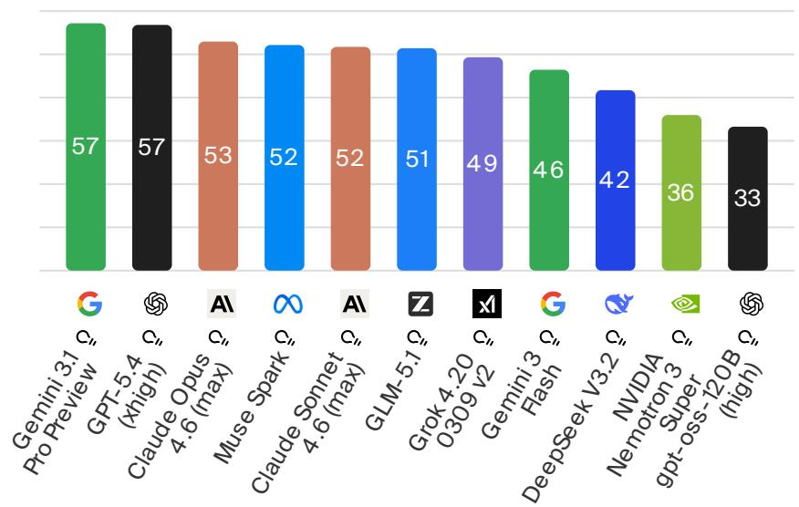
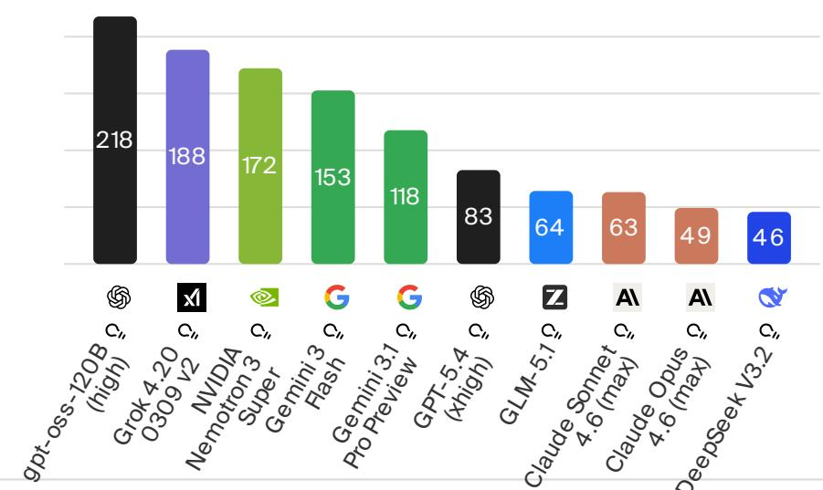
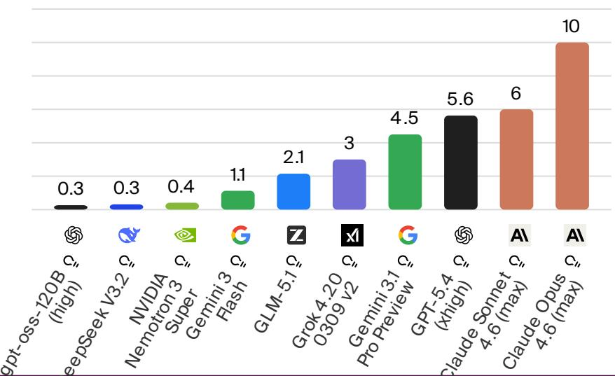
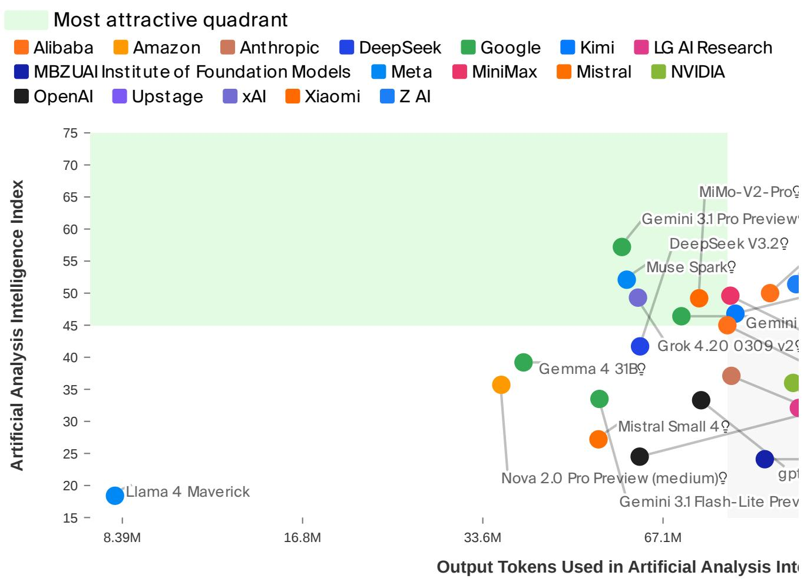

# Independent Analysis of AI Models and API Providers -- Artificial Analysis, April 2026

## Source

- URL: https://artificialanalysis.ai/
- Captured: April 10, 2026

Artificial Analysis is an independent platform that benchmarks large language models across intelligence, speed, and pricing. The data below reflects the latest evaluations published in April 2026, covering both proprietary and open-weight models from major AI labs worldwide.

## Intelligence Index: Gemini 3.1 Pro Preview and GPT-5.4 Share the Lead at 57

The Artificial Analysis Intelligence Index is a composite score aggregating performance across a wide range of reasoning, knowledge, and instruction-following benchmarks. Higher scores indicate stronger overall capability.

As of April 2026, two models share the top position:

| Rank | Model | Provider | Intelligence Index |
|------|-------|----------|--------------------|
| 1 | Gemini 3.1 Pro Preview | Google | 57 |
| 2 | GPT-5.4 (xhigh) | OpenAI | 57 |
| 3 | Claude Opus 4.6 (max) | Anthropic | 53 |
| 4 | Muse Spark | Meta | 52 |
| 5 | Claude Sonnet 4.6 (max) | Anthropic | 52 |
| 6 | GLM-5.1 | Z AI | 51 |
| 7 | Grok 4.20 0309 v2 | xAI | 49 |
| 8 | Gemini 3 Flash | Google | 46 |
| 9 | DeepSeek V3.2 | DeepSeek | 42 |
| 10 | NVIDIA Nemotron 3 Super | NVIDIA | 36 |
| 11 | gpt-oss-120B (high) | OpenAI | 33 |

Google and OpenAI are neck-and-neck at the frontier. Anthropic's Claude Opus 4.6 trails by 4 points, while Meta's newly released Muse Spark enters at a strong 52. Open-weight models such as GLM-5.1 and Grok 4.20 occupy the mid-tier, demonstrating that the gap between proprietary and open-weight models continues to narrow.

## Output Speed: Open-Weight Models Dominate Throughput

Inference speed, measured in output tokens per second, is critical for latency-sensitive applications. The leaderboard shows a striking pattern: open-weight and smaller models generate tokens far faster than frontier proprietary models.

| Rank | Model | Output Tokens/s |
|------|-------|-----------------|
| 1 | gpt-oss-120B (high) | 218 |
| 2 | Grok 4.20 0309 v2 | 188 |
| 3 | NVIDIA Nemotron 3 Super | 172 |
| 4 | Gemini 3 Flash | 153 |
| 5 | Gemini 3.1 Pro Preview | 118 |
| 6 | GPT-5.4 (xhigh) | 83 |
| 7 | GLM-5.1 | 64 |
| 8 | Claude Sonnet 4.6 (max) | 63 |
| 9 | Claude Opus 4.6 (max) | 49 |
| 10 | DeepSeek V3.2 | 46 |

The fastest model, gpt-oss-120B (high), outputs 218 tokens per second -- more than 4x the speed of Claude Opus 4.6 and nearly 5x that of DeepSeek V3.2. This highlights the trade-off between raw intelligence and throughput: the two intelligence leaders (Gemini 3.1 Pro Preview and GPT-5.4) sit in the middle of the speed table at 118 and 83 tokens/s respectively.

## Pricing: A 33x Gap Between Cheapest and Most Expensive

API pricing per million tokens varies enormously across models, reflecting differences in compute requirements, margin strategies, and competitive positioning.

| Rank | Model | USD per 1M Tokens |
|------|-------|--------------------|
| 1 | gpt-oss-120B (high) | $0.30 |
| 2 | DeepSeek V3.2 | $0.30 |
| 3 | NVIDIA Nemotron 3 Super | $0.40 |
| 4 | Gemini 3 Flash | $1.10 |
| 5 | GLM-5.1 | $2.10 |
| 6 | Grok 4.20 0309 v2 | $3.00 |
| 7 | Gemini 3.1 Pro Preview | $4.50 |
| 8 | GPT-5.4 (xhigh) | $5.60 |
| 9 | Claude Sonnet 4.6 (max) | $6.00 |
| 10 | Claude Opus 4.6 (max) | $10.00 |

The cheapest options -- gpt-oss-120B and DeepSeek V3.2 at $0.30 per million tokens -- are over 33x less expensive than Claude Opus 4.6 at $10.00. For budget-sensitive workloads, this price differential is a decisive factor. Notably, Gemini 3 Flash offers a compelling mid-range value at $1.10, pairing solid speed (153 tokens/s) with reasonable intelligence (46).

## The Intelligence-Throughput Frontier: Finding the "Most Attractive Quadrant"

A scatter plot of Intelligence Index versus output tokens consumed during evaluation reveals which models occupy the "most attractive quadrant" -- high intelligence with efficient token usage. Models that achieve high scores while consuming fewer tokens represent better engineering and more efficient architectures.

Key observations from the scatter plot:

- Gemini 3.1 Pro Preview and DeepSeek V3.2 cluster in the upper region, indicating strong intelligence scores.
- Grok 4.20 0309 v2 and several Google models sit in the middle-right region, balancing intelligence and token efficiency.
- Llama 4 Maverick occupies the low-intelligence, low-token region, suggesting it is neither efficient nor highly capable.
- MiMo-V2-Pro appears in the upper-right corner, showing very high intelligence but with substantial token usage.

## Proprietary vs. Open-Weight Models

The April 2026 landscape shows proprietary models still leading on raw intelligence, but the margin is thin. GLM-5.1, an open-weight model from Z AI, scores 51 -- just 6 points behind the co-leaders. Meanwhile, open-weight models like gpt-oss-120B dominate on speed and price. The intelligence leaderboard includes models from at least 8 distinct organizations across the US, China, and Europe, reflecting a genuinely global competition.

| Metric | Proprietary Leader | Score | Open-Weight Leader | Score |
|--------|--------------------|-------|--------------------|-------|
| Intelligence | Gemini 3.1 Pro Preview | 57 | GLM-5.1 | 51 |
| Speed (tokens/s) | Gemini 3 Flash | 153 | gpt-oss-120B (high) | 218 |
| Price ($/1M tokens) | Gemini 3 Flash | $1.10 | gpt-oss-120B (high) | $0.30 |

## Key Findings

- **Two-way tie at the top**: Gemini 3.1 Pro Preview and GPT-5.4 (xhigh) both score 57 on the Artificial Analysis Intelligence Index, making them the co-leaders as of April 2026.
- **Speed and intelligence are inversely correlated**: The fastest model (gpt-oss-120B at 218 tokens/s) scores only 33 on intelligence, while the smartest models operate at 49-118 tokens/s.
- **Massive pricing spread**: A 33x cost gap separates the cheapest ($0.30/1M tokens for gpt-oss-120B and DeepSeek V3.2) from the most expensive ($10.00/1M tokens for Claude Opus 4.6).
- **Open-weight models are closing the gap**: GLM-5.1 at 51 intelligence is within 10% of the proprietary leaders, while also being significantly cheaper at $2.10/1M tokens.
- **No single model wins on all three axes**: Choosing a model requires explicit trade-offs among intelligence, speed, and cost depending on the use case.
