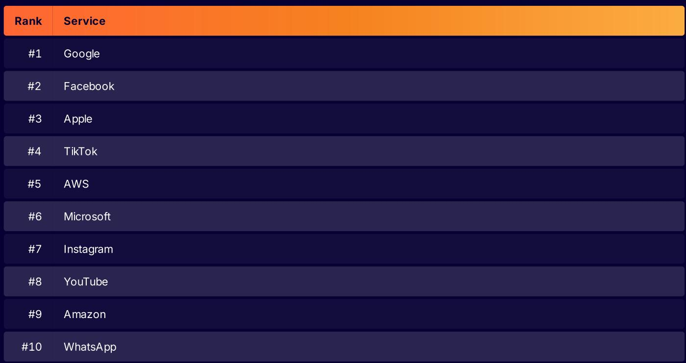
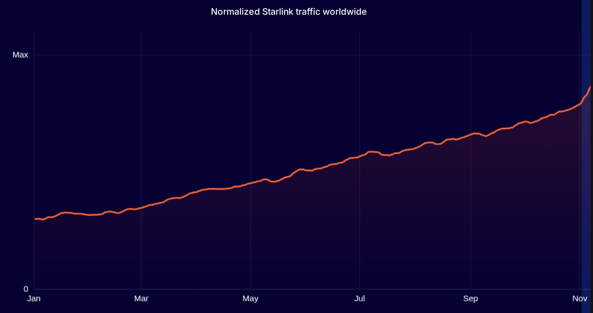
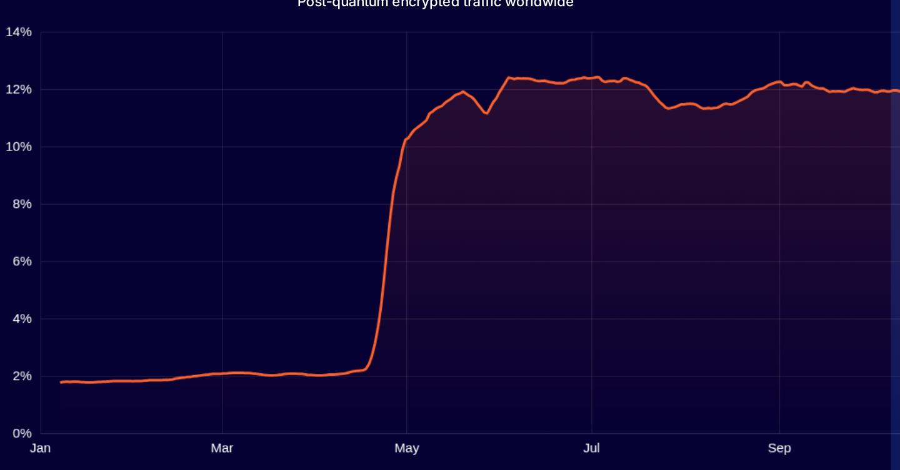
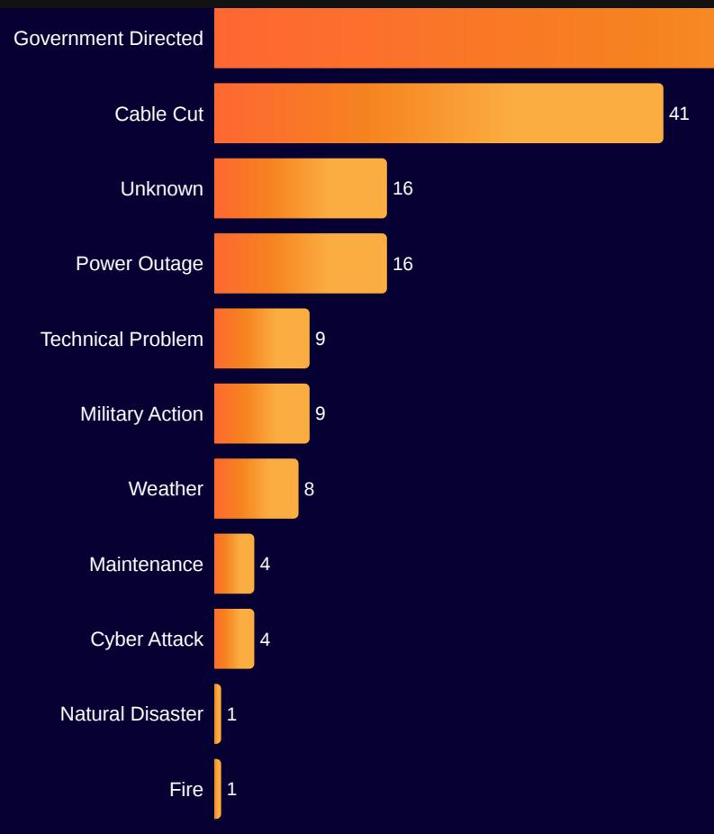

# Cloudflare Radar 2024 Year in Review

## Source

URL: https://radar.cloudflare.com/year-in-review/2024

The Cloudflare Radar 2024 Year in Review provides a comprehensive view of Internet patterns and trends observed through Cloudflare's global network during 2024. The report covers traffic growth, popular services, technology adoption, connectivity disruptions, security threats, and email security trends. Data is derived from Cloudflare's position as a provider protecting and accelerating websites and applications for millions of customers worldwide.

## Internet Traffic Growth and Popular Services

Global Internet traffic grew by 17% in 2024, continuing the upward trend driven by increasing reliance on the Internet for communication, commerce, entertainment, and transportation. The trend line starts mid-January to normalize for post-holiday activity.

Google maintained its position as the most popular Internet service overall, topping the rankings for the second consecutive year. Generative AI continued its rapid rise throughout 2024, while the Metaverse receded into the background. The ranking methodology is based on aggregate data from Cloudflare's 1.1.1.1 DNS resolver.

| Rank | Service   |
|------|-----------|
| #1   | Google    |
| #2   | Facebook  |
| #3   | Apple     |
| #4   | TikTok    |
| #5   | AWS       |
| #6   | Microsoft |
| #7   | Instagram |
| #8   | YouTube   |
| #9   | Amazon    |
| #10  | WhatsApp  |

SpaceX Starlink traffic saw dramatic 3.3x growth during 2024, continuing to bring satellite Internet connectivity to previously underserved locations. Starlink is not yet available globally; the trend line is scaled relative to peak observed request volume.

## Technology Adoption and Usage Patterns

Several key adoption metrics emerged from the 2024 data:

- **Mobile OS**: 33% of traffic came from iOS devices. Apple iOS and Google Android remain the dominant mobile operating systems, with peak Android traffic share exceeding 95% in some regions and peak iOS reaching around 66%.
- **HTTP/3**: 21% of traffic uses HTTP/3, the most recent version of the protocol that runs on top of QUIC, providing faster connections, packet-loss mitigation, and encryption by default.
- **Search Engines**: Google dominates with 89% of search engine referral traffic, followed by Yandex (3.1%), Baidu (2.7%), Bing (2.6%), DuckDuckGo (0.95%), and other engines (2.2%).
- **Browsers**: Chrome remains the most popular browser globally.
- **API Client Languages**: Go is the most popular API client language with approximately 12% of automated API requests, followed by Node.js, Python (9.6%), Java (7.4%), and .NET (3.6%).

Post-quantum encryption saw a dramatic surge in adoption during 2024. Starting at around 2% of TLS 1.3 traffic in early 2024, adoption jumped sharply following Google Chrome 124 enabling post-quantum key agreement by default on April 17, rapidly climbing to approximately 12-13%. Mozilla Firefox has also started rolling out post-quantum by default, and Apple Safari began initial testing.

## Internet Connectivity and Disruptions

Cloudflare observed 225 major Internet disruptions globally in 2024. These outages result from a variety of causes, and the Cloudflare Radar Outage Center tracks their scope and duration using Cloudflare traffic data.

The leading causes of Internet disruptions were:

| Cause                | Count |
|----------------------|-------|
| Government Directed  | 116+  |
| Cable Cut            | 41    |
| Unknown              | 16    |
| Power Outage         | 16    |
| Technical Problem    | 9     |
| Military Action      | 9     |
| Weather              | 8     |
| Maintenance          | 4     |
| Cyber Attack         | 4     |
| Natural Disaster     | 1     |
| Fire                 | 1     |

IPv6 adoption reached 28% of dual-stack traffic during 2024. Spain recorded the highest download speed among all countries measured.

41% of global traffic came from mobile devices, reflecting the continued importance of mobile connectivity worldwide.

## Security Landscape

Cloudflare mitigated 6.5% of all traffic it processed, indicating the scale of ongoing threats. The Gambling and Games sector was the most attacked industry category. Notably, 68% of global bot traffic originated from just the top 10 countries.

The Log4j vulnerability (CVE-2021-44228), first disclosed in December 2021, continues to be actively targeted by attackers more than two years later, underscoring the persistent nature of widely known vulnerabilities.

RPKI (Resource Public Key Infrastructure) valid routes increased by 6.4%, an important step toward improved Internet routing security.

## Email Security Threats

Cloudflare's email security analysis revealed that 4.3% of emails processed were malicious. Among those malicious emails, 43% contained a deceptive link designed to trick recipients. The top-level domain .bar originated the largest share of malicious and spam email observed during the year.

## Key Findings

- Global Internet traffic grew 17% year-over-year, with Starlink traffic surging 3.3x as satellite connectivity expanded to underserved regions.
- Post-quantum encryption adoption leapt from approximately 2% to 13% of TLS 1.3 traffic following Chrome 124's default enablement in April 2024.
- Government-directed shutdowns remained the leading cause of the 225 major Internet disruptions observed, followed by cable cuts (41 incidents) and power outages (16).
- Security threats remained pervasive: 6.5% of all traffic was mitigated, Gambling/Games was the most targeted sector, and Log4j exploitation persists years after disclosure.
- Go surpassed other languages to become the most popular API client language, capturing roughly 12% of automated API traffic.
