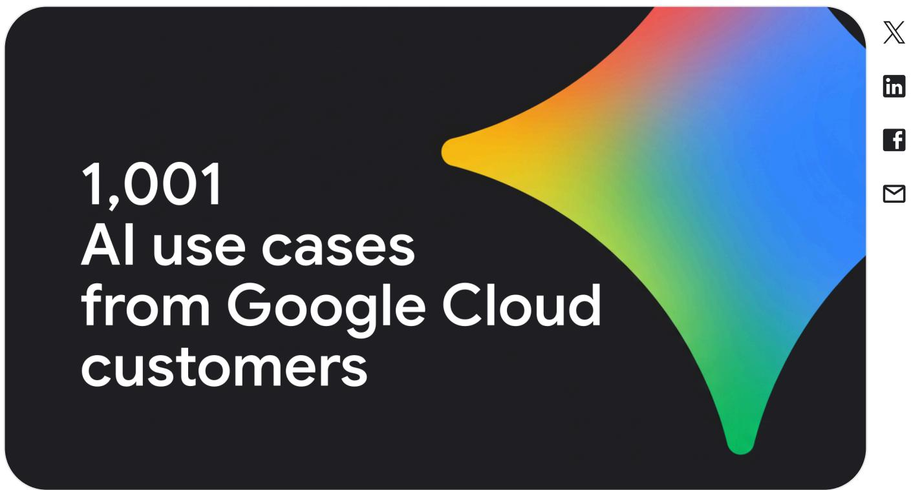
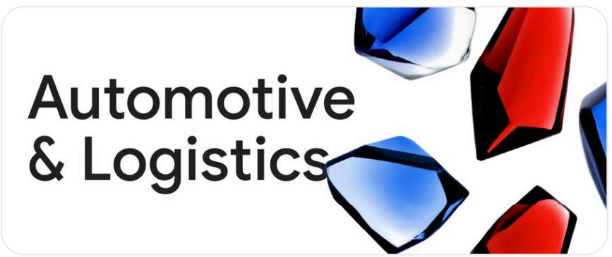

# 1,001 Real-World Gen AI Use Cases from Google Cloud Customers

## Source

Google Cloud Blog — "1,001 real-world gen AI use cases from the world's leading organizations"  
URL: https://cloud.google.com/transform/101-real-world-generative-ai-use-cases-from-industry-leaders  
Published: April 12, 2024; last updated: October 9, 2025  
Authors: Matt Renner (President & CRO, Google Cloud), Matt A.V. Chaban (Senior Editor)

## Overview and Growth Trajectory

Google Cloud first published its list of real-world generative AI use cases during Cloud Next 24 in April 2024, starting with 101 entries. By October 2025, the list had grown **10×** to 1,001 use cases — and the authors note this still only scratches the surface of what is becoming possible.

The list is organized by **11 major industry groups** and within those, **6 agent types**: Customer, Employee, Creative, Code, Data, and Security. The October 2025 edition added 400 new entries (denoted with an asterisk). Organizations span top companies, governments, researchers, and startups worldwide.

The 11 industry verticals are:
- Automotive & Logistics
- Business & Professional Services
- Financial Services
- Healthcare & Life Sciences
- Hospitality & Travel
- Manufacturing, Industrial & Electronics
- Media, Marketing & Gaming
- Public Sector & Nonprofits
- Retail
- Technology
- Telecommunications

## Automotive & Logistics: Detailed Use Cases by Agent Type

The Automotive & Logistics vertical provides one of the richest cross-sections of agent types. Below is a representative sample:

| Agent Type | Organization | Use Case Summary | Key Metric / Detail |
|---|---|---|---|
| Customer | Mercedes-Benz | MBUX Virtual Assistant powered by Gemini via Vertex AI enables natural driver conversations for navigation and POI | Natural language in-car assistant |
| Customer | LUXGEN (Taiwan EV) | AI agent on LINE answers customer questions via Vertex AI | Reduced human CS workload by **30%** |
| Customer | General Motors (OnStar) | Virtual assistant with Google Cloud conversational AI recognizes speaker intent | Improved intent recognition |
| Customer | Volkswagen of America | myVW app virtual assistant lets drivers query owner's manuals; multimodal camera feature for dashboard indicators | Gemini multimodal capabilities |
| Customer | UPS Capital | DeliveryDefense Address Confidence uses ML to score delivery success likelihood | Data-driven delivery confidence |
| Customer | PODS / Tombras | "World's Smartest Billboard" on trucks adapted to NYC neighborhoods in real time using Gemini | **6,000+ unique headlines**, 299 neighborhoods, 29 hours |
| Employee | Toyota | AI platform on Google Cloud enables factory workers to build and deploy ML models | **10,000+ man-hours/year** saved |
| Employee | Uber | AI agents summarize CS communications and surface prior interaction context | Improved CS rep effectiveness |
| Employee | Rivian | Gemini in Google Workspace for instant research, accelerated learning, and rapid skill acquisition | Faster onboarding and deep research |
| Employee | Rivian | NotebookLM centralizes FAQ answers with verified sources and interactive chat | Reduced repetitive inquiries |
| Employee | Geotab | Google Workspace with Gemini for research, summarization, legal review, data filtering across 4.7M connected vehicles | Cross-functional productivity |
| Employee | Routematic | Migrated entire infrastructure to Google Cloud (Compute Engine, GKE) in 8 months with zero downtime | Release cycles shortened from **weeks to days** |
| Employee | 704 Apps | Gemini analyzes in-trip audio to measure emotional "temperature" and flag hostile language for safety alerts | Real-time safety monitoring |
| Code | Renault Group (Ampere) | Enterprise Gemini Code Assist understands company code base, standards, and conventions | Developer productivity for EV software |

## Headline ROI and Impact Numbers Across Industries

Several organizations reported quantified business outcomes:

- **Mercari** (Japan's largest online marketplace): Anticipates **500% ROI** while reducing employee workloads by **20%** through AI-powered customer service.
- **LUXGEN**: Customer service agent workload reduced by **30%** with Vertex AI chatbot.
- **Toyota**: Factory AI platform saved over **10,000 man-hours per year**.
- **PODS / Tombras**: Generated **6,000+ unique ad headlines** across all 299 NYC neighborhoods in just **29 hours**.
- **Virgin Voyages**: Uses Veo text-to-video to create **thousands of hyper-personalized ads and emails** in a single batch without sacrificing brand voice.
- **Figma**: Enables organizations to create high-quality, brand-approved images and assets **in seconds**.
- **Commerzbank**: Making it easier than ever to reach a customer service agent via gen AI.

## Cross-Industry Patterns

Three dominant patterns emerge across the 1,001 use cases:

1. **Conversational Customer Agents** are the most visible entry point — automotive (Mercedes-Benz, GM, VW, LUXGEN), financial services (Commerzbank), and retail (Mercari) all deploy AI-powered virtual assistants to handle customer queries, reduce wait times, and lower human agent workloads.

2. **Employee Productivity Agents** are the broadest category — companies like Uber, Rivian, Geotab, and Oxa use Gemini for Google Workspace to summarize documents, accelerate research, draft content, review legal documents, and filter data across departments from HR to engineering.

3. **Creative and Scale Agents** represent the fastest-growing frontier — Virgin Voyages' hyper-personalized video campaigns, PODS' real-time adaptive billboards, and Figma's instant brand-approved asset generation demonstrate that gen AI is moving from text into multimodal creative production at enterprise scale.

## Key Findings

- **10× growth in 18 months**: The list expanded from 101 to 1,001 use cases between April 2024 and October 2025, reflecting accelerating enterprise gen AI adoption.
- **Customer and Employee agents dominate**: Conversational assistants and workplace productivity tools are the most common deployment patterns across all 11 industries.
- **Measurable ROI is being achieved in production**: Organizations report outcomes including 500% ROI (Mercari), 30% workload reduction (LUXGEN), 10,000+ man-hours saved annually (Toyota), and thousands of creative assets generated in hours (Virgin Voyages, PODS).
- **Six agent types provide a useful adoption framework**: Customer, Employee, Creative, Code, Data, and Security agents offer enterprises a structured way to identify and prioritize gen AI opportunities.
- **The pace is accelerating**: With 400 new entries added in the latest update alone, the trajectory suggests enterprise gen AI deployment is still in its early exponential phase.