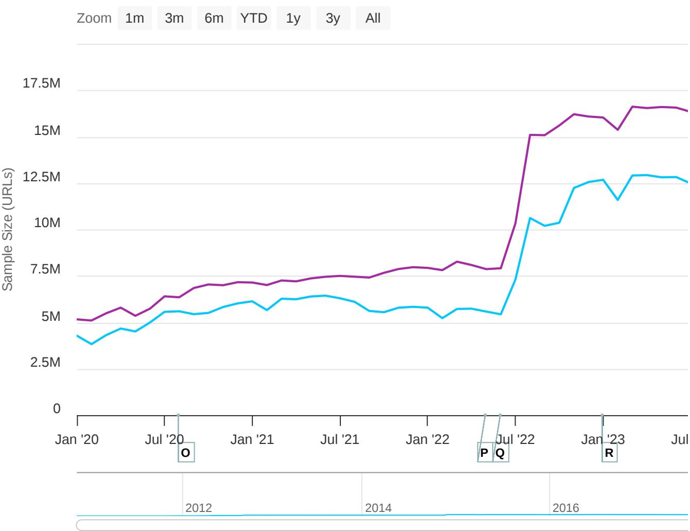
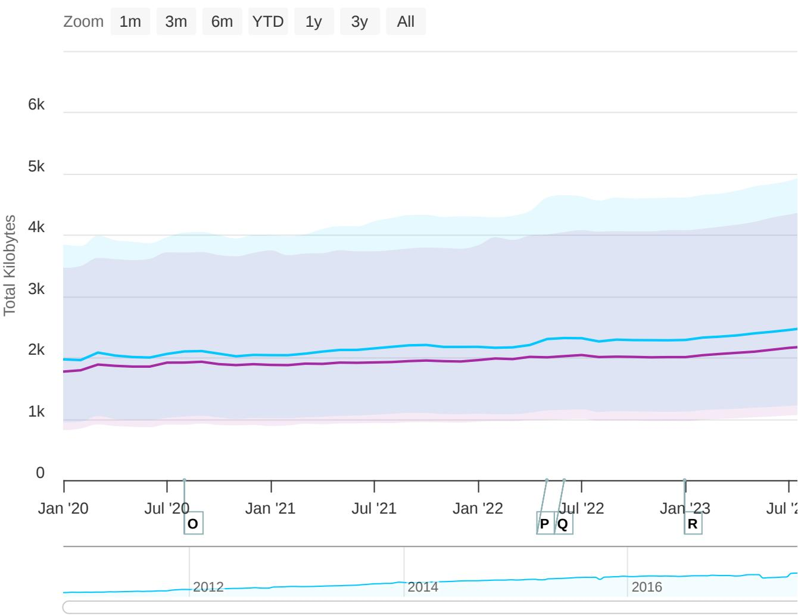
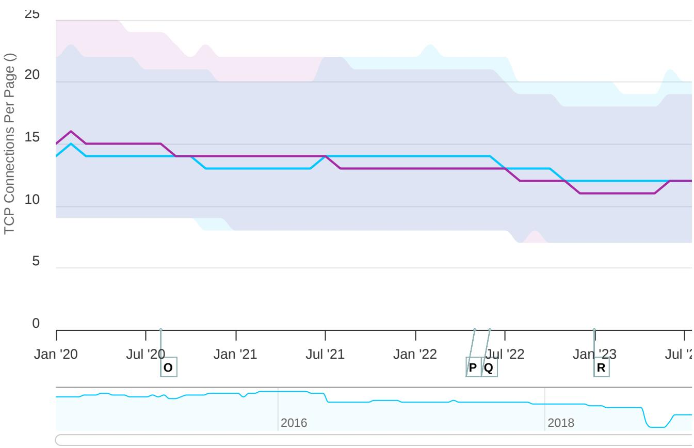

# State of the Web 2020–2025: HTTP Archive Trends

## Source

HTTP Archive — State of the Web Report  
https://httparchive.org/reports/state-of-the-web?start=2020_01_01&end=latest&view=list

## Overview

The HTTP Archive continuously crawls millions of URLs and records how the web is built. The "State of the Web" report tracks macro-level metrics including page weight, request counts, protocol adoption (HTTPS, HTTP/2, HTTP/3), TCP connection counts, and CSS best-practice adoption such as `font-display`. The data below covers January 2020 through early 2026, with desktop and mobile measured separately.

## Sample Size

The crawl sample has grown substantially. In January 2020 the desktop crawl covered roughly 5 million URLs and mobile roughly 3.5 million. By mid-2022 both lines jumped sharply — desktop reaching ~15 million and mobile ~10 million — before stabilizing around 16 million (desktop) and 12.5 million (mobile) by mid-2023 onward.

## Page Weight & Requests

Median total transfer size has risen gradually over five years. Desktop pages now weigh approximately 2,000 KB (median), up from ~1,600 KB in early 2020. Mobile pages track slightly lower but follow the same upward trend. The 75th-percentile desktop page exceeds 4,000 KB, indicating a long tail of heavy pages.

The median number of resources requested per page is 76 on desktop and 71 on mobile, each up roughly 3% over the observation period.

| Metric | Desktop | Mobile | Desktop Δ | Mobile Δ |
|---|---|---|---|---|
| Total Kilobytes (median) | ~2,000 KB | ~1,900 KB | ▲ ~25% | ▲ ~25% |
| Total Requests (median) | 76 | 71 | ▲ 2.7% | ▲ 2.9% |
| TCP Connections / Page (median) | 12.0 | 11.0 | ▼ 14.3% | ▼ 26.7% |

## TCP Connections Per Page

Despite growing request counts, the median number of TCP connections per page has fallen — from about 15 (desktop) and 15 (mobile) in early 2020 to 12 and 11 respectively. This decline reflects the multiplexing benefits of HTTP/2 and HTTP/3, which allow many requests over fewer connections.

## Protocol & Security Adoption

### HTTPS

HTTPS adoption is now effectively universal. 99.2% of desktop requests and 99.1% of mobile requests use HTTPS, representing an increase of roughly 19–20 percentage points since early 2020 when adoption was around 80%.

### HTTP/2

HTTP/2 accounts for 58.6% of desktop requests and 57.6% of mobile requests. Growth has been modest recently (1–3%), partly because HTTP/3 is absorbing some of the newer adoption.

### HTTP/3 Support

HTTP/3 support has seen explosive growth. Desktop support stands at 38.7% and mobile at 40.0%. The percentage increases from the 2020 baseline are enormous (reported as 38,600% desktop and 5,614% mobile) because the starting point was near zero. Note: HTTP Archive measures HTTP/3 *support* rather than actual usage because fresh Chrome instances default to HTTP/2 on first connection before discovering HTTP/3 capability via Alt-Svc headers.

| Protocol Metric | Desktop | Mobile |
|---|---|---|
| HTTPS Requests | 99.2% | 99.1% |
| HTTP/2 Requests | 58.6% | 57.6% |
| HTTP/3 Support | 38.7% | 40.0% |

## Font-Display Adoption

The `font-display` CSS property helps avoid the Flash of Invisible Text (FOIT) during web font loading. As measured by Lighthouse, 40.1% of desktop pages and 42.5% of mobile pages now use this property — up 14.9% and 61.0% respectively since 2020. While adoption is growing, more than half of pages still risk FOIT.

## Key Findings

- **Page weight keeps climbing**: Median desktop pages now transfer ~2,000 KB, roughly 25% heavier than in 2020, driven by richer media and JavaScript.
- **HTTPS is the new baseline**: At 99%+ of requests, unencrypted HTTP is essentially extinct on the modern web.
- **HTTP/3 is the fastest-growing protocol metric**: From near-zero to ~40% support in under four years, HTTP/3 is rapidly becoming mainstream.
- **Fewer TCP connections despite more requests**: Multiplexing in HTTP/2 and HTTP/3 has cut median connections per page by 15–27%, improving network efficiency.
- **Font-display still underused**: At ~40–42% adoption, there is significant room for improvement in avoiding invisible text during font loading.