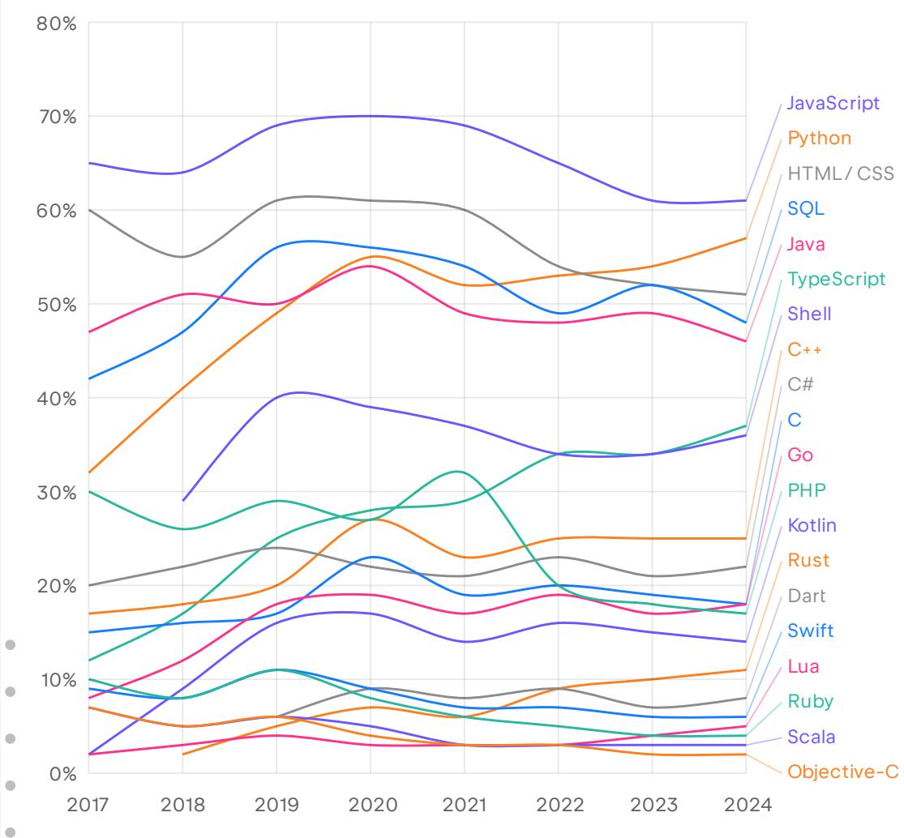
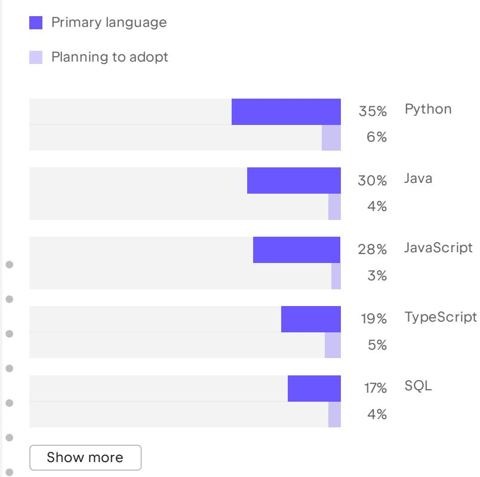
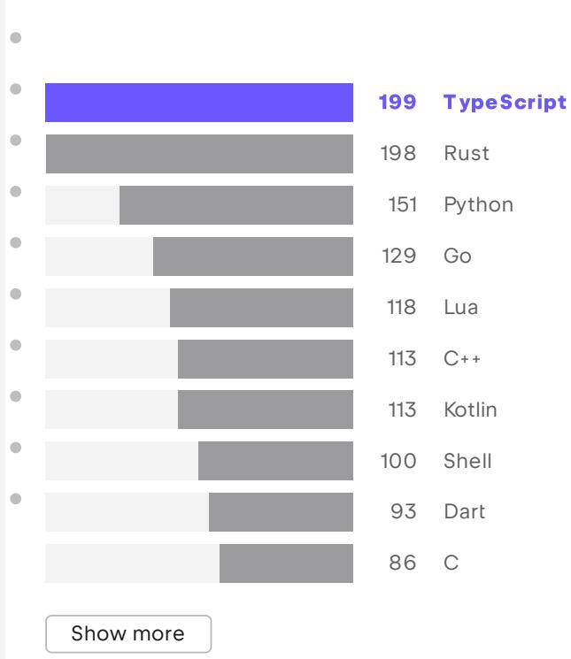
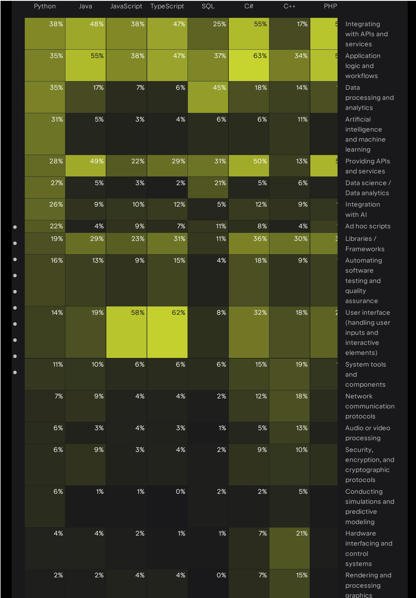

# State of Developer Ecosystem 2024: Language Trends, AI Adoption, and Career Shifts

## Source
JetBrains State of Developer Ecosystem Report 2024 (https://www.jetbrains.com/lp/devecosystem-2024/), based on responses from 23,262 developers worldwide. The annual survey captures programming language usage, tooling preferences, AI sentiment, and employment trends across the global developer community.

## Programming Language Usage (2017-2024)

The survey tracks 20 programming, scripting, and markup languages over eight consecutive years. JavaScript remains the most used language overall at 61%, though it has declined from a peak of 70% in 2020. Python has risen steadily from 32% in 2017 to 57% in 2024, nearly closing the gap with JavaScript. TypeScript continues its ascent from 12% in 2017 to 37% in 2024, tripling its share.

| Language | 2017 | 2020 | 2022 | 2024 | Trend |
|----------|:----:|:----:|:----:|:----:|-------|
| JavaScript | 65% | 70% | 65% | 61% | Declining from peak |
| Python | 32% | 55% | 53% | 57% | Steady growth |
| HTML/CSS | 60% | 61% | 54% | 51% | Gradual decline |
| SQL | 42% | 56% | 49% | 48% | Plateaued |
| Java | 47% | 54% | 48% | 46% | Slow decline |
| TypeScript | 12% | 28% | 34% | 37% | Strong growth |
| Go | 8% | 19% | 19% | 18% | Plateaued after growth |
| Rust | -- | 7% | 9% | 11% | Steady growth |
| PHP | 30% | 27% | 20% | 17% | Significant decline |
| Kotlin | 2% | 17% | 16% | 14% | Plateaued |

## Primary Languages and Adoption Intent

Developers show strong loyalty to their chosen ecosystems. Python leads as the primary language for 35% of developers, followed by Java at 30%, JavaScript at 28%, TypeScript at 19%, and SQL at 17%. Adoption intent remains modest across all languages, suggesting developers rarely plan to switch their primary stack. Only 6% plan to adopt Python, 5% TypeScript, and 4% each for Java and SQL.

## Most Loved Languages and Developer Satisfaction

When asked about developer satisfaction, TypeScript leads with a score of 199, just edging out Rust at 198. Python follows at 151, with Go at 129 and Lua at 118. C++ and Kotlin tie at 113, Shell scores 100, Dart reaches 93, and C rounds out the top 10 at 86. The strong showing by TypeScript and Rust reflects developer enthusiasm for languages that combine safety, modern tooling, and expressive type systems.

## Language Use Cases by Domain

Different languages dominate distinct application domains. Python leads in data processing and analytics (17% selecting it), artificial intelligence and machine learning (31%), and data science/data analytics (28%). JavaScript and TypeScript together dominate user interface development (58% and 62% respectively). Java is the top choice for providing APIs and services (49%), while C++ leads in system tools and components (27%), hardware interfacing (21%), and rendering and processing graphics (15%). SQL serves as the backbone for data analytics and ad hoc query scenarios.

| Domain | Top Language | Share |
|--------|-------------|:-----:|
| AI / Machine Learning | Python | 31% |
| Data Processing & Analytics | Python | 17% |
| User Interface | TypeScript | 62% |
| APIs & Services | Java | 49% |
| Application Logic & Workflows | Java | 55% |
| System Tools & Components | C++ | 27% |
| Integrating with APIs & Services | Python | 38% |

## Go and Rust: The Most Adopted Languages

Go and Rust stand out as the languages developers most plan to adopt. Both are designed with performance and concurrency as priorities and offer compiler safety guarantees that help reduce bugs. Go has stabilized at around 18% usage after rapid growth from 8% in 2017, while Rust continues climbing from effectively zero to 11%. Their appeal lies in addressing modern infrastructure needs -- microservices, cloud-native tooling, and systems programming -- where performance and reliability are non-negotiable.

## Key Findings

1. **Python overtakes JavaScript as primary language**: While JavaScript is still the most widely used language overall (61%), Python has become the most common primary language at 35%, reflecting its dominance in AI/ML and data science.

2. **TypeScript and Rust lead developer satisfaction**: TypeScript (199) and Rust (198) score nearly identically as the most loved languages, both prized for type safety and modern developer experience.

3. **PHP and Ruby in long-term decline**: PHP dropped from 30% in 2017 to 17% in 2024; Ruby fell from 10% to 4%. Both are losing ground to newer alternatives in web development and scripting.

4. **Developers stick with what they know**: Adoption intent for new primary languages remains below 6% across the board, suggesting that ecosystem lock-in and expertise investment keep developers loyal to their chosen stacks.

5. **AI and data science drive Python growth**: Python's rise correlates directly with the AI/ML boom, as it is the overwhelming choice for artificial intelligence (31%), data science (28%), and data processing tasks.
