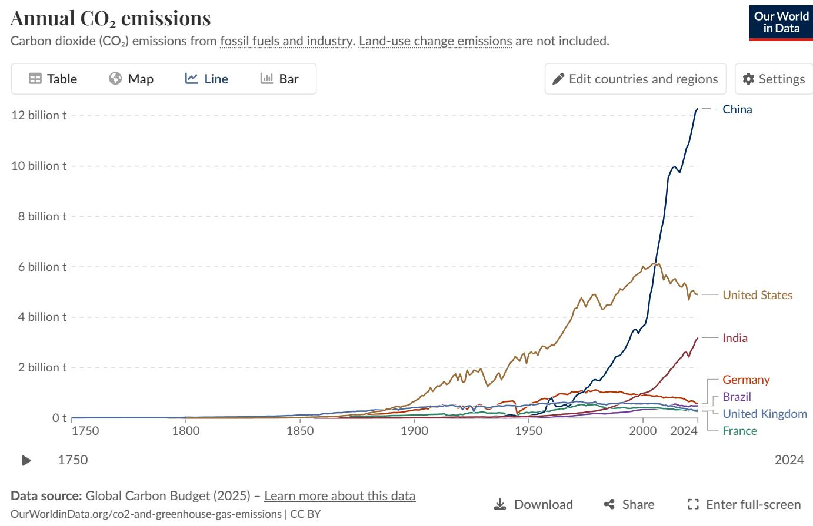
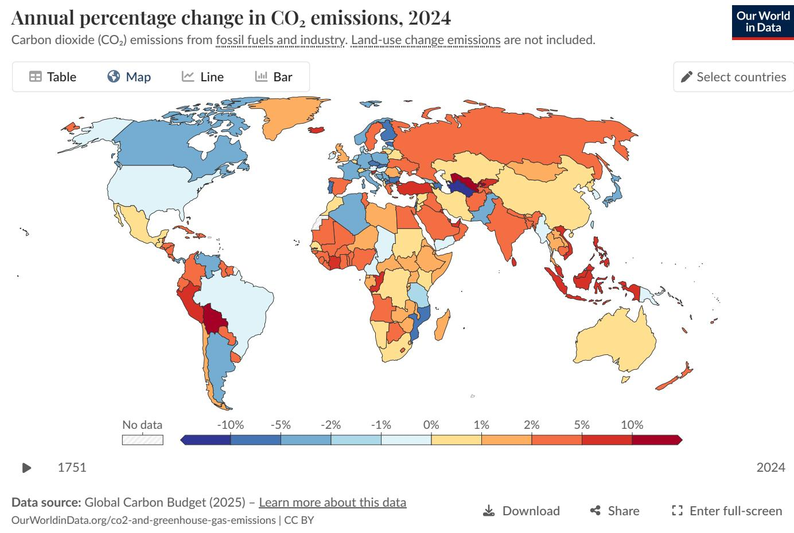
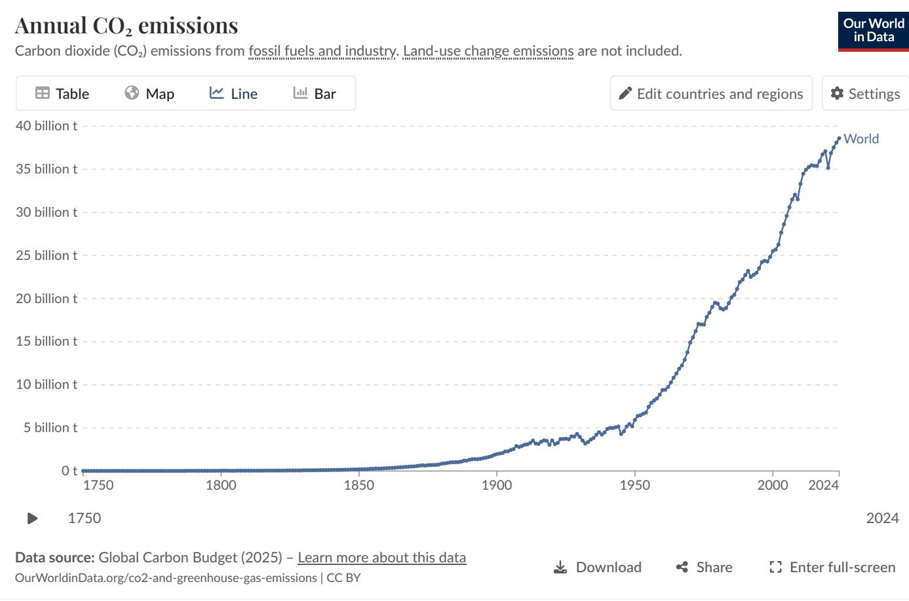

# Global CO₂ Emissions: Trends, Regional Shifts, and Per Capita Inequalities

## Source
https://climate.nasa.gov/vital-signs/carbon-dioxide/ and Our World in Data — CO₂ and Greenhouse Gas Emissions (Global Carbon Budget 2025)

## Atmospheric CO₂ Concentration

The latest measurement from NOAA's Mauna Loa Observatory (February 2026) records atmospheric CO₂ at **429 parts per million (ppm)**. This represents a more than 50% increase from the pre-industrial baseline of approximately 280 ppm. The current level is at least 1.5 times greater than the natural increase observed at the end of the last ice age 20,000 years ago — a change that took thousands of years then but has occurred in roughly two centuries now. Ground-based and satellite measurements confirm the sharp acceleration, linked primarily to the burning of coal, oil, and natural gas.

## Global Emissions Trajectory (1750–2024)

Before the Industrial Revolution, CO₂ emissions were negligible. Growth remained relatively slow until the mid-20th century. In **1950**, the world emitted roughly **6 billion tonnes** of CO₂. By **1990**, emissions had nearly quadrupled to over **20 billion tonnes**. Today, global annual emissions from fossil fuels and industry exceed **35 billion tonnes**. While emissions growth has slowed in recent years, they have not yet peaked.

## Who Emits the Most? Country-Level Totals

China is the world's largest emitter by a significant margin, producing over 12 billion tonnes annually — more than one-quarter of the global total. The United States peaked near 6 billion tonnes around 2005 and has since declined to roughly 5 billion tonnes. India has risen rapidly to approximately 3 billion tonnes. Europe's share has fallen substantially.

| Country / Region | Approx. Annual CO₂ (billion t) | Share of Global | Trend (recent) |
|---|---|---|---|
| China | ~12.5 | ~27% | Slight increase |
| United States | ~5.0 | ~14% | Declining |
| India | ~3.0 | ~8% | Rising |
| EU-27 | ~2.7 | ~7% | Declining |
| Germany | ~0.6 | ~1.7% | Declining |
| United Kingdom | ~0.3 | ~0.9% | Declining |
| Brazil | ~0.5 | ~1.4% | Roughly stable |
| France | ~0.3 | ~0.8% | Declining |

In 1900, Europe and the US accounted for more than 90% of global emissions. By 1950, they still represented over 85%. Today, they account for less than one-third, while Asia — home to nearly 60% of the world's population — produces roughly half of all emissions. Africa and South America each contribute only 3–4%, comparable to international aviation and shipping combined.

## Per Capita Emissions: Extreme Inequalities

Per capita CO₂ emissions reveal stark global inequalities. The world's highest per capita emitters are major oil-producing nations with small populations (Qatar, UAE, Bahrain, Kuwait). Among large, populous countries, the US, Australia, and Canada have per capita emissions roughly three times the global average.

| Country | Per Capita CO₂ (tonnes/year) |
|---|---|
| United States | ~15 |
| Canada | ~13 |
| Australia | ~15 |
| South Africa | ~8 |
| China | ~9 |
| EU-27 | ~7 |
| World average | ~5 |
| United Kingdom | ~4 |
| France | ~4 |
| India | ~2 |
| Kenya | <1 |
| Chad / Niger | ~0.1 |

The gap between the highest and lowest per capita emitters is approximately **150-fold**: the average American or Australian emits in under two days what the average person in Chad or Niger emits in an entire year. Importantly, countries with similar living standards can differ significantly — France and the UK have much lower per capita emissions than Germany or the Netherlands, largely because of their energy mix (higher nuclear and renewable shares).

## 2024 Annual Change in Emissions

The 2024 map of annual percentage change in CO₂ emissions shows a mixed picture. The United States and much of Europe recorded declines (roughly −1% to −5%), shown in blue. Russia, parts of Southeast Asia, and several African nations saw increases of +2% to +10% or more, shown in orange and red. Some countries in South America (notably one or two) experienced very large percentage increases (>10%), while others saw declines.

## Key Findings

- **Global CO₂ emissions now exceed 35 billion tonnes per year** and have not yet peaked, despite slowing growth rates.
- **China alone accounts for over 25% of global emissions** (~12.5 Bt), more than double the United States (~5 Bt); India (~3 Bt) is the third-largest and rising fast.
- **The geographic center of emissions has shifted dramatically**: from >90% in Europe and the US in 1900 to Asia producing ~50% today, while the US and Europe combined are below one-third.
- **Per capita inequalities are extreme** — a 150× gap separates the highest emitters (US, Australia at ~15 t/person) from the lowest (Chad, Niger at ~0.1 t/person).
- **Energy mix and policy choices matter**: countries with similar prosperity levels (e.g., France vs. Germany) can have very different per capita emissions depending on their reliance on nuclear, renewables, or fossil fuels.