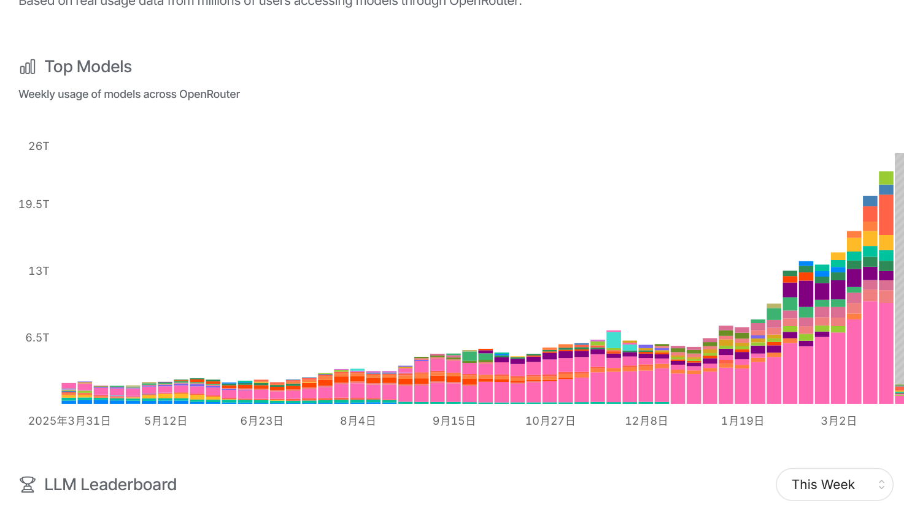
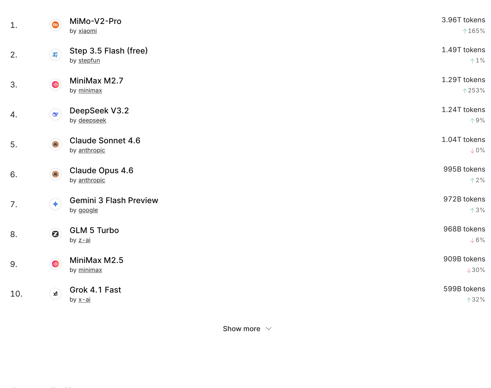
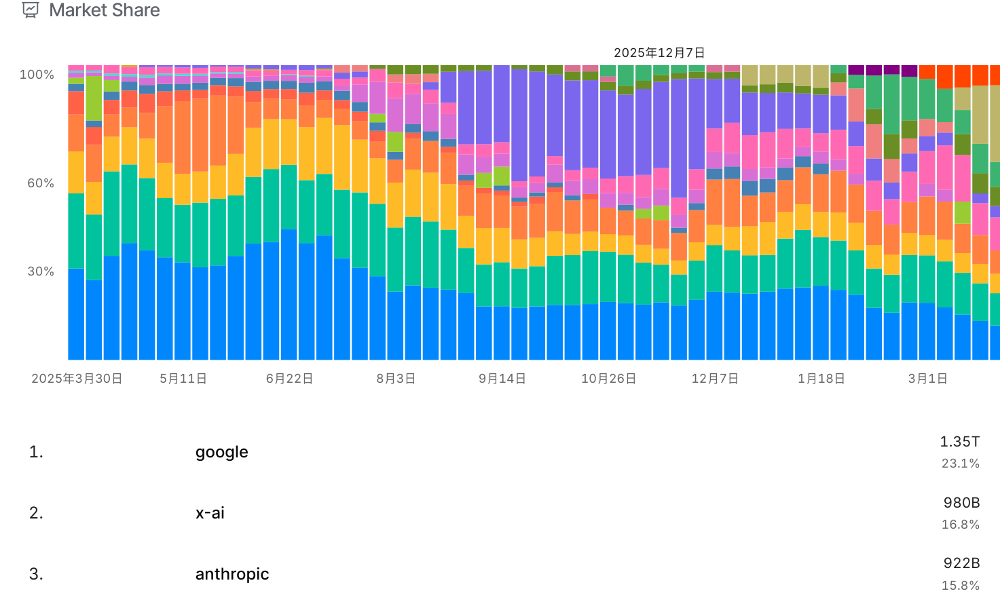
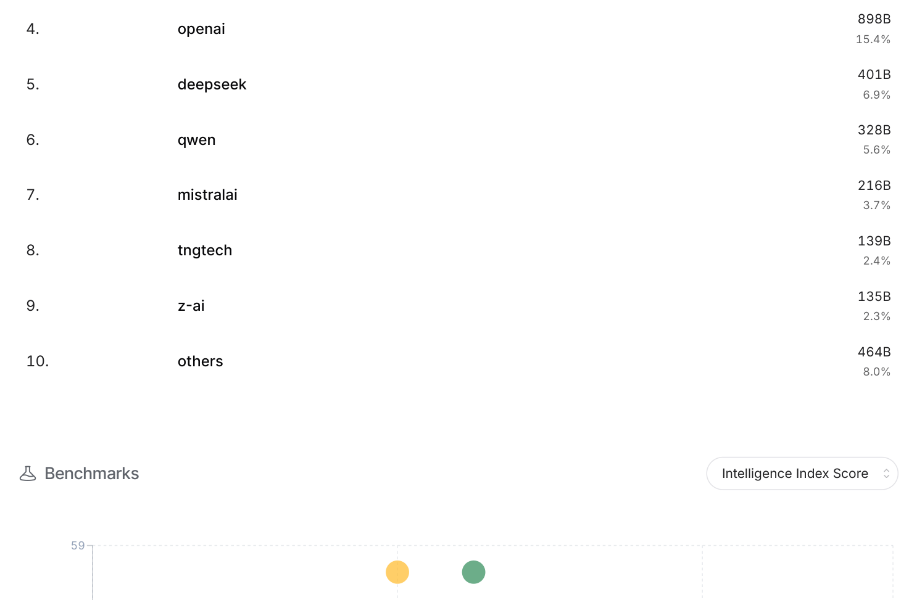
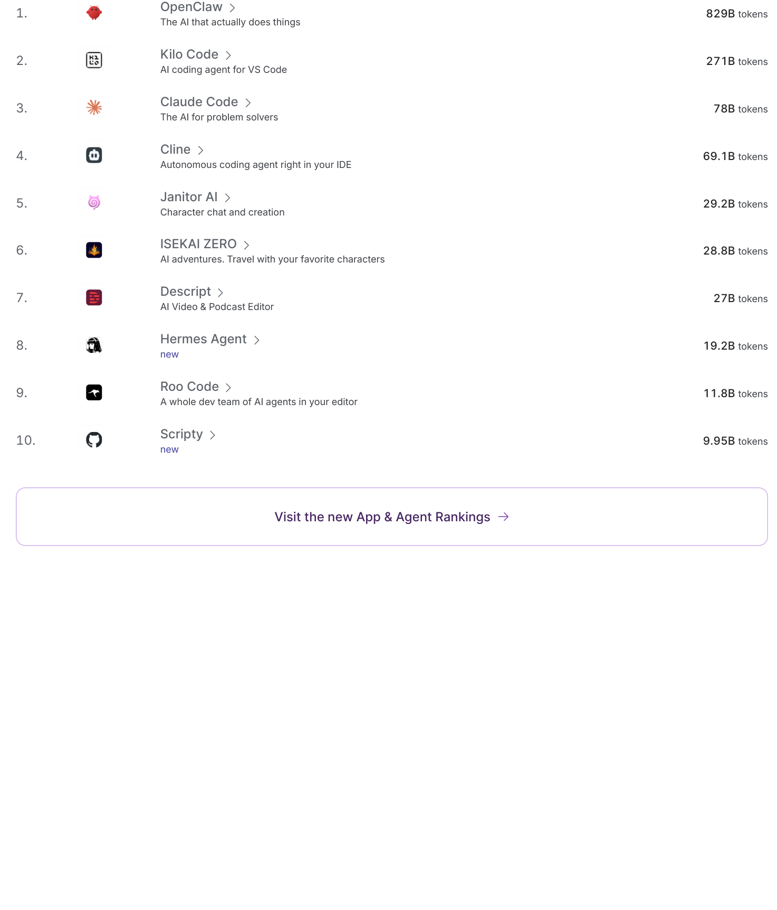

# The 2025 LLM Usage Landscape: Real-World Data from OpenRouter

## Data Source
OpenRouter is one of the largest LLM API aggregation platforms, capturing real usage data from millions of users. The data below is sourced from the OpenRouter Rankings page (https://openrouter.ai/rankings) and covers the most recent week of March 2025.

## Weekly Model Usage Trends

## This Week's Top 10 Models

| Rank | Model | Provider | Weekly Token Usage | WoW Change |
|:---:|------|------|:---:|:---:|
| 1 | MiMo-V2-Pro | Xiaomi | 3.96T | +165% |
| 2 | Step 3.5 Flash (free) | Stepfun | 1.49T | +1% |
| 3 | MiniMax M2.7 | MiniMax | 1.29T | +253% |
| 4 | DeepSeek V3.2 | DeepSeek | 1.24T | +9% |
| 5 | Claude Sonnet 4.6 | Anthropic | 1.04T | -0% |
| 6 | Claude Opus 4.6 | Anthropic | 995B | +2% |
| 7 | Gemini 3 Flash Preview | Google | 972B | +3% |
| 8 | GLM 5 Turbo | Zhipu (z-ai) | 968B | -6% |
| 9 | MiniMax M2.5 | MiniMax | 909B | -30% |
| 10 | Grok 4.1 Fast | x-ai | 599B | +32% |

**Key Findings**:
- Chinese providers hold 6 of the top 10 spots (Xiaomi, Stepfun, MiniMax ×2, DeepSeek, Zhipu)
- Xiaomi's MiMo-V2-Pro leads by a wide margin at 3.96T tokens, with 165% week-over-week growth
- MiniMax M2.7 posted the strongest growth at +253% week-over-week
- Anthropic's two models (Sonnet 4.6 + Opus 4.6) combine for roughly 2T tokens, but growth has stalled

## Provider Market Share (by Token Volume)

| Rank | Provider | Weekly Token Volume | Market Share |
|:---:|------|:---:|:---:|
| 1 | Xiaomi | 1.31T | 25.9% |
| 2 | Google | 594B | 11.8% |
| 3 | Anthropic | 555B | 11.0% |
| 4 | MiniMax | 429B | 8.5% |
| 5 | OpenAI | 400B | 7.9% |
| 6 | Stepfun | 341B | 6.8% |
| 7 | DeepSeek | 334B | 6.6% |
| 8 | Zhipu (z-ai) | 326B | 6.5% |
| 9 | x-ai | 195B | 3.9% |
| 10 | Others | 563B | 11.2% |

**Key Findings**:
- Xiaomi leads decisively at 25.9%, more than double the second-place Google
- Combined Chinese provider share: Xiaomi + MiniMax + Stepfun + DeepSeek + Zhipu ≈ 54.3%, exceeding half the market
- OpenAI ranks only fifth at 7.9%
- The market is highly fragmented — no single provider exceeds 30%

## Fastest-Growing Models

| Model | Provider | WoW Growth |
|------|------|:---:|
| MiniMax M2.7 | MiniMax | +253% |
| MiMo-V2-Pro | Xiaomi | +165% |
| Cline (coding agent) | Independent developer | +128% |
| Hermes Agent | Nous Research | +92% |
| Ampere | Ampere | +576% |
| Codex | OpenAI | +112% |

## Top Apps (by Daily Token Consumption)

| Rank | App | Description | Daily Token Volume |
|:---:|------|------|:---:|
| 1 | OpenClaw | AI productivity assistant — "The AI that actually does things" | 829B |
| 2 | Kilo Code | VS Code AI coding assistant | 271B |
| 3 | Claude Code | Anthropic's CLI coding tool | 78B |
| 4 | Cline | VS Code autonomous coding agent | 69.1B |
| 5 | Janitor AI | Character roleplay chat | 29.2B |
| 6 | ISEKAI ZERO | AI adventure game | 28.8B |
| 7 | Descript | AI video/podcast editor | 27B |
| 8 | Hermes Agent | Nous Research's AI agent | 19.2B |
| 9 | Roo Code | VS Code AI coding assistant | 11.8B |
| 10 | Scripty | Newly launched tool | 9.95B |

**Key Findings**:
- The top 4 apps are all **AI coding tools** (OpenClaw, Kilo Code, Claude Code, Cline)
- AI coding agents have become the single largest LLM consumption scenario
- Entertainment/roleplay apps (Janitor AI, ISEKAI ZERO) still hold a notable presence
- OpenClaw consumes 829B tokens per day — nearly 3× the second-place app

## Industry Trend Observations

1. **Chinese Models Break Through Globally**: On OpenRouter, an international platform, Chinese provider models now account for over half of all usage. Xiaomi's MiMo series, DeepSeek V3, and MiniMax's M2 series hold a significant cost-performance advantage.

2. **Flash/Turbo Variants Outpace Flagship Models**: Step 3.5 Flash, GLM 5 Turbo, Gemini 3 Flash, and other "fast and affordable" models see far higher usage than their flagship counterparts. Users are voting with their feet — in real-world applications, speed and cost often matter more than peak performance.

3. **AI Coding Agents Dominate Usage**: 5 of the top 10 apps are coding tools. This reflects the largest commercial value proposition for LLMs today — helping developers write code.

4. **A Highly Fragmented Market**: No single model or provider monopolizes the market. The top 10 spans 8 different providers, signaling that competition remains fierce and the landscape is far from settled.
