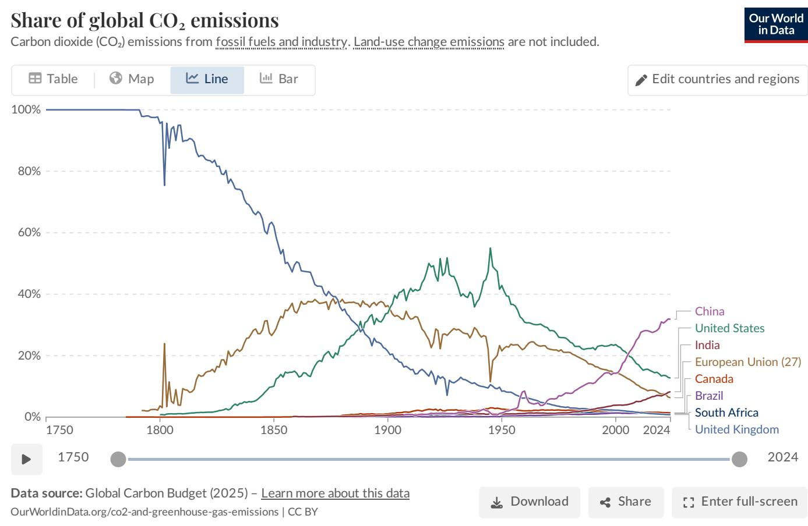
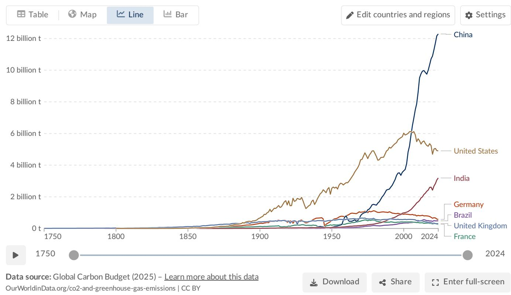
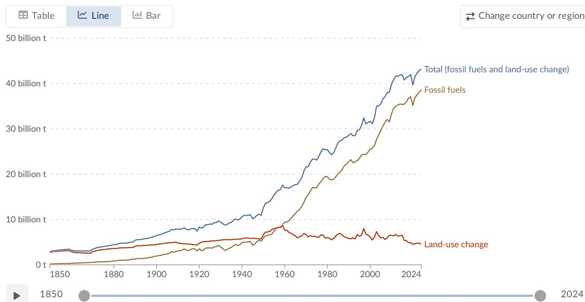
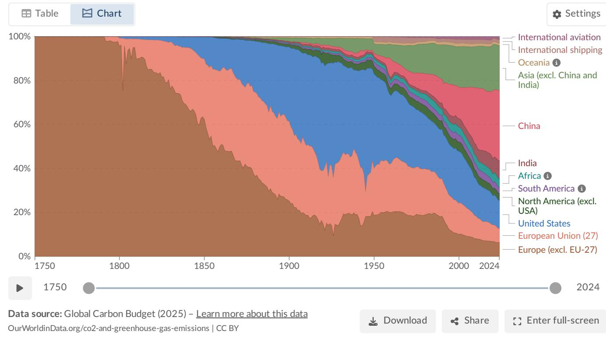

# Global CO₂ Emissions: Who Emits, How Much, and What's Changing

## Source
https://ourworldindata.org/co2-emissions — Data from the Global Carbon Budget (2025). Authors: Hannah Ritchie and Max Roser.

## Global Emission Trajectory

Global CO₂ emissions from fossil fuels and industry have grown dramatically since the Industrial Revolution. Before industrialization, emissions were negligible. By 1950, the world emitted roughly 6 billion tonnes (Bt) of CO₂ per year. By 1990, this had nearly quadrupled to over 20 Bt. Today, global emissions exceed 35 Bt annually. While growth has slowed in recent years, emissions have not yet peaked.

Emissions from land-use change have declined slightly in recent years, but fossil fuel emissions continue to dominate the total.

## Regional and Country Shares

The distribution of emissions has shifted profoundly over time. In 1900, Europe and the United States accounted for more than 90% of global CO₂ emissions. By 1950, they still represented over 85%. Today, they account for less than one-third. Asia — led by China — now dominates, producing roughly half of global emissions.

| Country / Region | Approx. Share of Global CO₂ (2024) | Trend |
|---|---|---|
| China | ~31% | Rising, growth slowing |
| United States | ~13% | Declining |
| India | ~8% | Rising |
| European Union (27) | ~6% | Declining |
| Russia | ~5% | Roughly stable |
| Africa (total) | ~3–4% | Slowly rising |
| South America (total) | ~3–4% | Roughly stable |
| Int'l aviation & shipping | ~3% | Rising |

Africa and South America each account for only 3–4% of global emissions — comparable to international aviation and shipping combined.

## Per Capita Emissions and Inequality

Per capita CO₂ emissions reveal stark global inequalities. The world's largest per capita emitters are major oil-producing nations with small populations (Qatar, UAE, Bahrain, Kuwait). Among large, populous countries, the United States, Australia, and Canada have per capita emissions roughly three times the global average.

| Country | Per Capita CO₂ (approx. 2024) |
|---|---|
| United States | ~14 t |
| Canada | ~14 t |
| China | ~9 t |
| South Africa | ~7 t |
| European Union (27) | ~6 t |
| World average | ~4.5 t |
| United Kingdom | ~4 t |
| India | ~2 t |
| Kenya | ~0.4 t |
| Chad / Niger | ~0.1 t |

The gap is enormous: the average American or Australian emits in under two days what the average person in Mali or Niger emits in an entire year — a roughly 150x difference.

Even among wealthy nations, per capita emissions vary significantly. France, the UK, and Portugal have much lower per capita emissions than Germany, the Netherlands, or the US, largely because a higher share of their electricity comes from nuclear and renewable sources rather than fossil fuels.

## 2024 Annual Change

The map of annual percentage change in CO₂ emissions for 2024 shows a mixed picture. Many Western nations — including the US, much of the EU, and the UK — saw emissions decline (shown in blue). Meanwhile, Russia, parts of Southeast Asia, and several African nations experienced increases (shown in orange and red). Some countries in Central Asia (e.g., Turkmenistan/Uzbekistan region) saw particularly large increases exceeding 10%.

## Key Findings

- **No peak yet**: Global CO₂ emissions from fossil fuels exceed 35 billion tonnes per year and have not yet peaked, despite slowing growth.
- **Dramatic shift in responsibility**: Europe and the US dominated emissions historically (>90% in 1900) but now account for less than one-third; China alone emits over a quarter of the global total.
- **Massive per capita inequality**: A 150x gap exists between the lowest emitters (Sub-Saharan Africa, ~0.1 t/person) and the highest large-country emitters (US/Canada/Australia, ~14–15 t/person).
- **Energy policy matters**: Countries with similar prosperity levels can have very different per capita emissions depending on their energy mix — France and the UK emit far less per capita than Germany or the US.
- **Mixed 2024 signals**: While many developed nations reduced emissions in 2024, increases in parts of Asia, the Middle East, and Africa offset some of these gains.