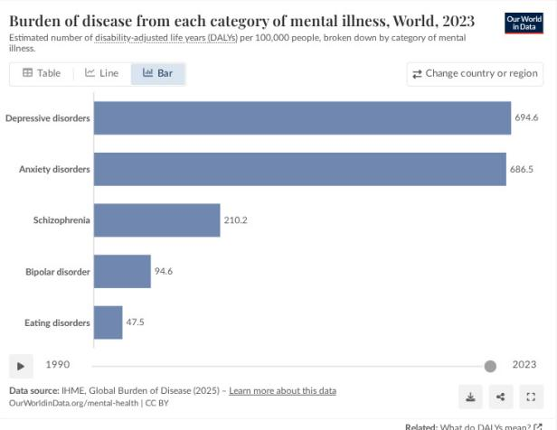
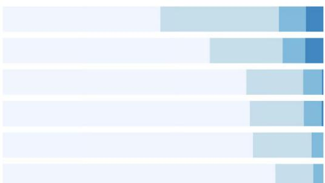

# The Global Burden of Mental Illness: Prevalence, Impact, and the Treatment Gap

## Source

Our World in Data — Mental Health  
URL: https://ourworldindata.org/mental-health  
Authors: Saloni Dattani, Lucas Rodés-Guirao, Hannah Ritchie, and Max Roser (2023)  
Data source: IHME, Global Burden of Disease (2025)

## Overview: Why Mental Health Matters

Mental health is an essential part of people's lives and society. Poor mental health affects well-being, the ability to work, and relationships with friends, family, and community. Hundreds of millions of people suffer from mental health conditions each year, and many more experience them over their lifetimes.

Key prevalence estimates:
- **1 in 3 women** will experience major depression in their lifetime.
- **1 in 5 men** will experience major depression in their lifetime.
- Other conditions such as schizophrenia and bipolar disorder are less common but have a large impact on individuals' lives.

Mental illnesses are treatable and their impact can be reduced. Despite this, treatment is often lacking or of poor quality. Many people feel uncomfortable sharing their symptoms with healthcare professionals or people they know, which also makes it difficult to estimate the actual prevalence of mental illnesses.

## Disease Burden by Category of Mental Illness (World, 2023)

The burden of disease is measured in disability-adjusted life years (DALYs) per 100,000 people. DALYs combine years of life lost due to premature death and years lived with disability, providing a comprehensive measure of overall disease impact.

| Mental Illness Category | DALYs per 100,000 people |
|---|---|
| Depressive disorders | 694.6 |
| Anxiety disorders | 686.5 |
| Schizophrenia | 210.2 |
| Bipolar disorder | 94.6 |
| Eating disorders | 47.5 |

Depressive disorders and anxiety disorders together dominate the global mental health burden, with nearly identical DALY rates (~695 and ~687 respectively). Combined, they account for roughly 80% of the total mental health disease burden across these five categories. Schizophrenia, while affecting fewer people, still contributes 210.2 DALYs per 100,000 — reflecting the severe disability associated with the condition. Bipolar disorder and eating disorders contribute smaller but meaningful shares.

## How People Cope with Mental Health Conditions

Global survey data reveals wide variation in how people deal with anxiety or depression:

- **Taking prescribed medication** — common in higher-income settings
- **Engaging in religious or spiritual activities** — prevalent in many regions worldwide
- **Talking to friends or family** — a widely reported coping mechanism

The diversity of coping strategies underscores that mental health responses are shaped by cultural, economic, and healthcare system factors. Policy interventions must account for these differences rather than applying a one-size-fits-all approach.

## The Treatment Gap and Data Challenges

Despite the availability of effective treatments, significant barriers persist:

- **Stigma**: Many people are uncomfortable disclosing symptoms to healthcare professionals or even to people they know.
- **Access**: Treatment is often lacking, especially in low- and middle-income countries.
- **Quality**: Even where treatment exists, it may be of poor quality.
- **Underreporting**: Discomfort with disclosure makes it difficult to estimate the true prevalence of mental illnesses, meaning the actual burden may be higher than reported figures suggest.

Good data is essential to understand these conditions — how, when, and why they occur, how many people are affected, and how they can be treated effectively and safely.

## Key Findings

- **Depression and anxiety are the dominant contributors** to the global mental health disease burden, each generating approximately 690 DALYs per 100,000 people — nearly equal in magnitude.
- **Schizophrenia carries a disproportionately high individual burden** relative to its prevalence, contributing 210.2 DALYs per 100,000.
- **Lifetime depression risk is substantial**: 1 in 3 women and 1 in 5 men will experience major depression.
- **A large treatment gap persists** due to stigma, poor access, and inadequate quality of care, meaning the true burden is likely underestimated.
- **Coping strategies vary widely** across countries and cultures, from medication to spiritual practices to social support, highlighting the need for culturally sensitive policy responses.