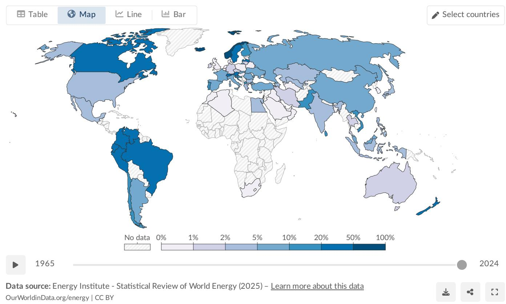
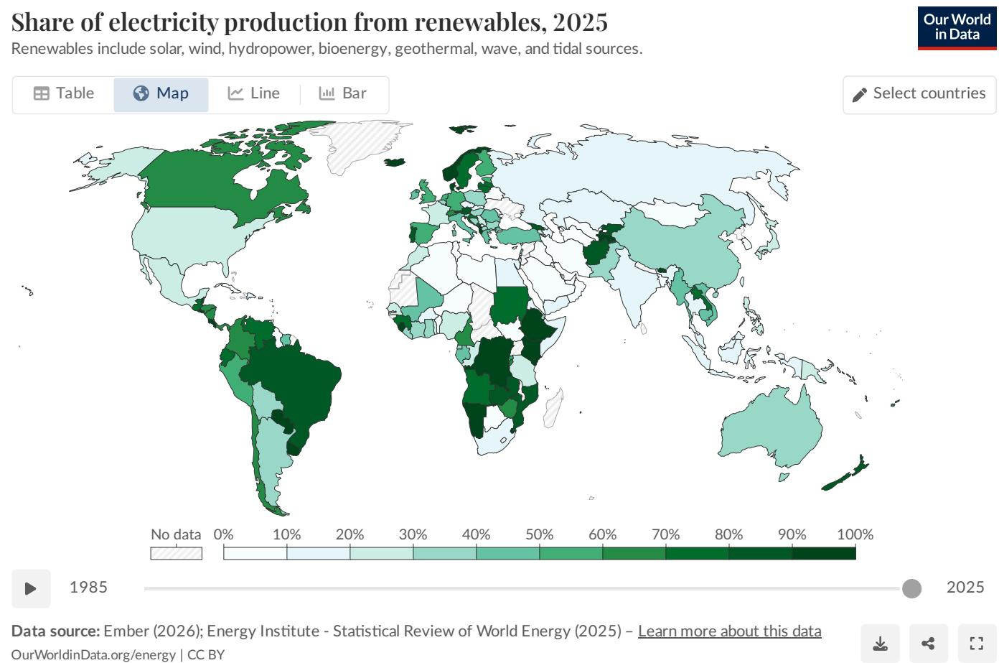
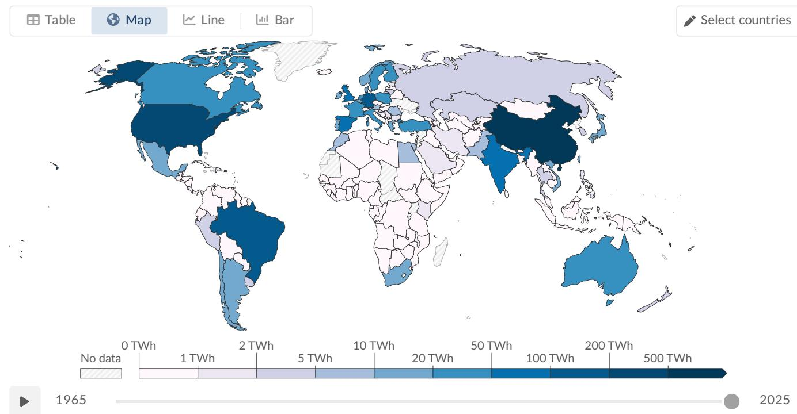
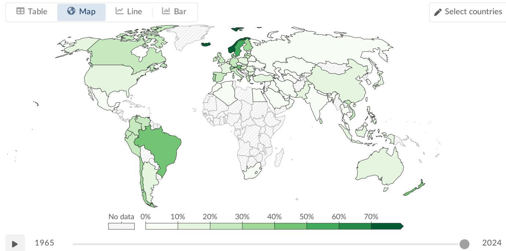
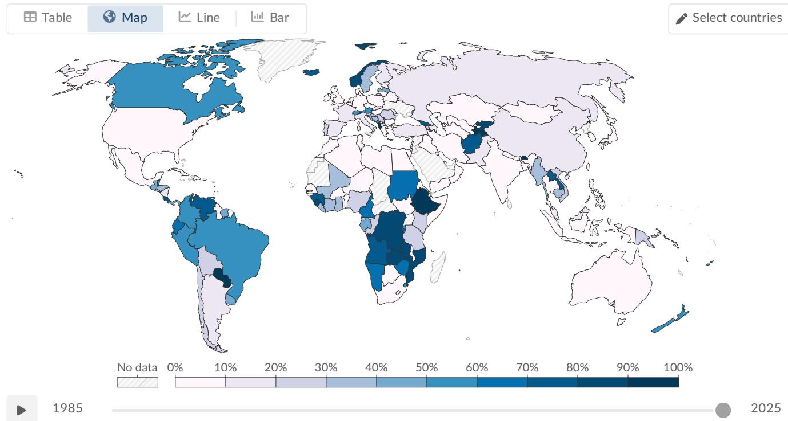

# Global Renewable Energy in 2025: How Far Have We Come?

## Source

Our World in Data – Renewable Energy  
URL: https://ourworldindata.org/renewable-energy  
Authors: Hannah Ritchie, Max Roser, Pablo Rosado  
Data sources: Ember (2026); Energy Institute – Statistical Review of World Energy (2025)

## The Urgency: Why Renewables Matter

Since the Industrial Revolution, most countries' energy systems have become dominated by fossil fuels. Three-quarters of global greenhouse gas emissions come from burning fossil fuels for energy. Fossil fuel combustion is also responsible for local air pollution that causes at least 5 million premature deaths per year. To reduce CO₂ emissions and air pollution, the world must rapidly shift toward low-carbon energy sources — nuclear and renewable technologies.

Renewable energy includes solar, wind, hydropower, geothermal, bioenergy, wave, and tidal sources. Traditional biomass (important in lower-income settings) is typically excluded from modern renewable statistics.

## Renewables in the Primary Energy Mix

Approximately one-seventh (~14%) of the world's primary energy now comes from renewable technologies (2024 data, substitution method). Primary energy encompasses electricity, transport, and heating combined. Because transport and heating are harder to decarbonize (more reliant on oil and gas), the renewable share in the total energy mix is lower than in the electricity mix alone.

Regional variation is significant. Countries like Norway, Brazil, and New Zealand derive large shares of primary energy from renewables, while fossil-fuel-producing nations in the Middle East and parts of Asia remain below 5%.

## Renewables in the Electricity Mix

Globally, almost one-third of electricity now comes from renewable sources (2025). This is substantially higher than the primary energy share because electricity is the sector where renewables have made the most progress.

| Region / Country | Renewable Share of Electricity (approx.) |
|---|---|
| Norway | ~98% |
| Brazil | ~85% |
| Canada | ~65% |
| Germany | ~55% |
| China | ~35% |
| United States | ~25% |
| India | ~25% |
| World average | ~30% |
| Saudi Arabia | <2% |
| South Africa | ~10% |

Several African and Middle Eastern countries have renewable electricity shares below 10%, reflecting both fossil fuel dependence and limited investment in renewables.

## Breakdown by Technology: Hydro, Wind, and Solar

**Hydropower** remains the single largest renewable electricity source, accounting for roughly half of all renewable generation. It has been generating electricity at scale for over a century. Top producers include China, Brazil, and Canada.

**Wind energy** has grown rapidly and is now a major contributor, especially in Europe, China, and the United States. Wind generation includes both onshore and offshore installations.

**Solar energy** is the fastest-growing source. Global solar generation has increased dramatically since 2010, driven by falling costs and policy support.

| Technology | Approx. Global Generation (2024, TWh) | Share of Renewable Electricity |
|---|---|---|
| Hydropower | ~4,500 | ~47% |
| Wind | ~2,400 | ~25% |
| Solar | ~2,000 | ~21% |
| Other renewables (geothermal, biomass, wave, tidal) | ~700 | ~7% |

While hydropower still leads, wind and solar combined now nearly match hydro's output and are growing much faster.

## Access and Regional Disparities

The transition to renewables is highly uneven. Scandinavian countries, Brazil, and Canada benefit from abundant hydropower. European nations like Denmark and Germany have invested heavily in wind and solar. Meanwhile, much of Sub-Saharan Africa has minimal renewable electricity infrastructure, and many Middle Eastern nations remain almost entirely dependent on fossil fuels for electricity.

## Key Findings

- **~14% of global primary energy** and **~30% of global electricity** now come from renewable sources — a significant milestone but far from sufficient for climate targets.
- **Hydropower remains dominant**, generating roughly half of all renewable electricity, but its growth potential is limited compared to wind and solar.
- **Wind and solar are the fastest-growing energy technologies** in history; combined, they now produce nearly as much electricity as hydropower.
- **Stark regional disparities persist**: Scandinavia and Latin America exceed 60–90% renewable electricity, while much of the Middle East and Sub-Saharan Africa remain below 10%.
- **Transport and heating lag far behind electricity** in the renewable transition, keeping the overall primary energy share much lower than the electricity share.