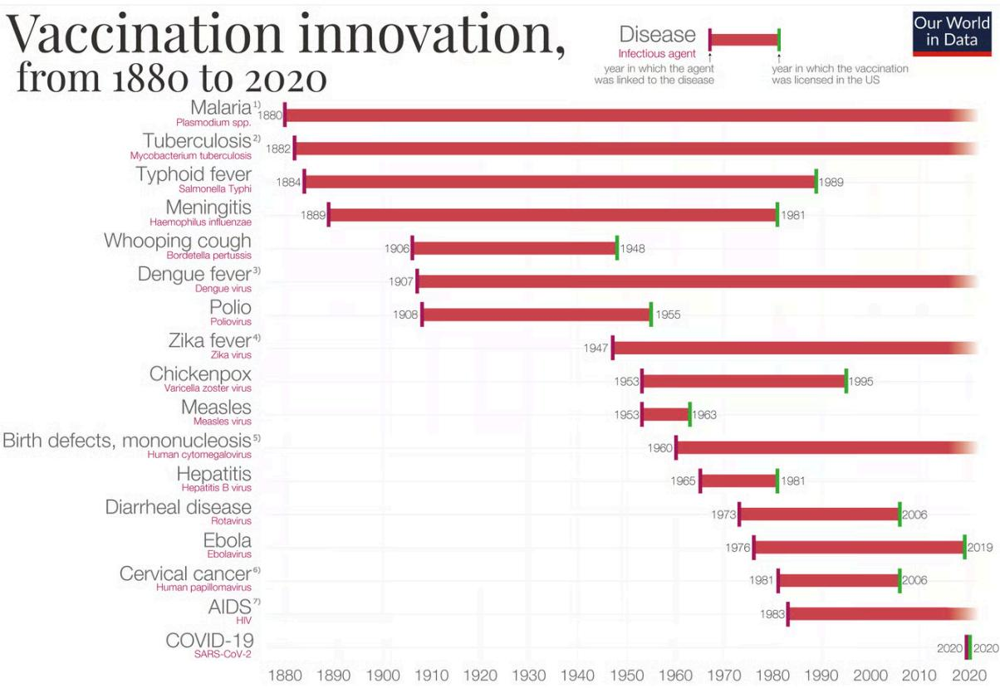
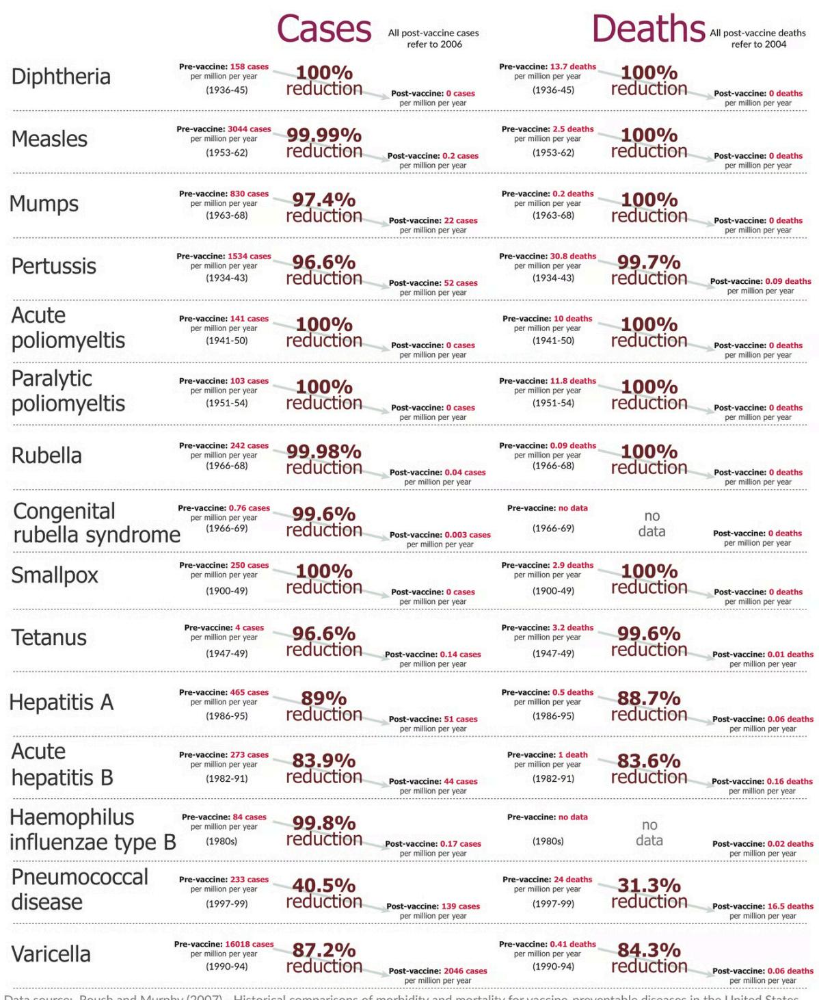
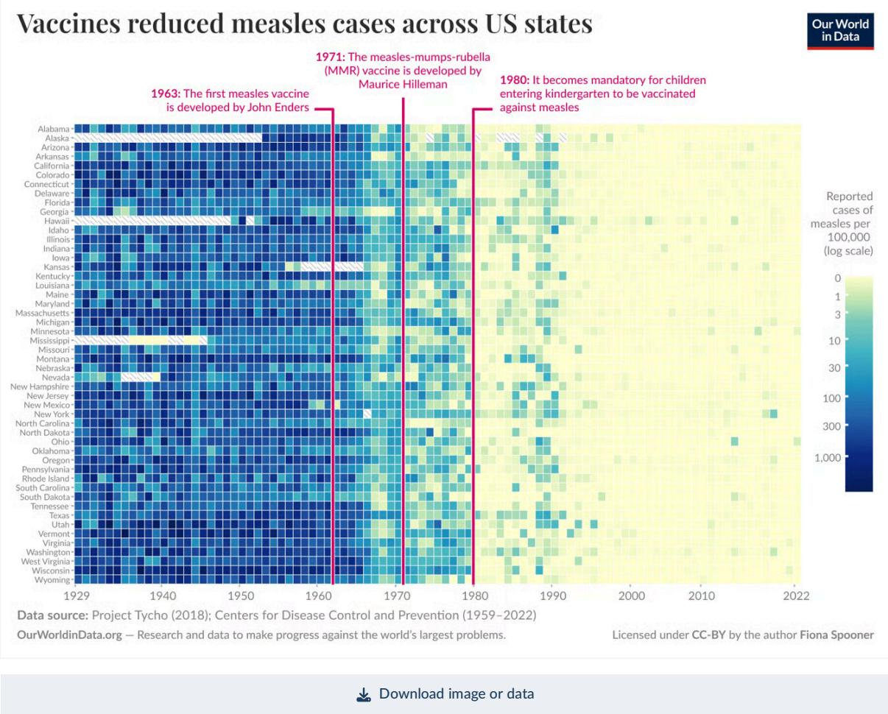

# The Power of Vaccination: History, Impact, and Remaining Challenges

## Source
https://ourworldindata.org/vaccination

## History of Vaccine Development

The first vaccine was created by Edward Jenner in 1796 against smallpox, using cowpox to trigger immunity. It took nearly a century before the next vaccine (rabies) was developed, because scientists didn't yet understand germ theory. Once Louis Pasteur and Robert Koch established germ theory in the late 19th century, vaccines for rabies, cholera, and anthrax followed.

The timeline from pathogen identification to vaccine licensure has shortened dramatically over the past 140 years:

| Disease | Pathogen Identified | Vaccine Licensed | Gap (Years) |
|---|---|---|---|
| Typhoid fever | 1884 | 1989 | 105 |
| Meningitis | 1889 | 1981 | 92 |
| Whooping cough | 1906 | 1948 | 42 |
| Polio | 1908 | 1955 | 47 |
| Measles | 1953 | 1963 | 10 |
| Chickenpox | 1953 | 1995 | 42 |
| Hepatitis B | 1965 | 1981 | 16 |
| Ebola | 1976 | 2019 | 43 |
| COVID-19 | 2020 | 2020 | <1 |

Modern tools — advanced microscopy, genome sequencing, mRNA technology, and virus-like particles — have enabled faster and more precise vaccine design.

## Dramatic Disease Reductions in the United States

Data from Roush and Murphy (2007) shows the reduction in cases and deaths for vaccine-preventable diseases in the US after vaccine introduction. Several diseases achieved 100% elimination of both cases and deaths.

| Disease | Pre-Vaccine Cases (per million/yr) | Post-Vaccine Cases (per million/yr) | Case Reduction | Pre-Vaccine Deaths (per million/yr) | Death Reduction |
|---|---|---|---|---|---|
| Diphtheria | 158 | 0 | 100% | 13.7 | 100% |
| Measles | 3,044 | 0.2 | 99.99% | 2.5 | 100% |
| Smallpox | 250 | 0 | 100% | 2.9 | 100% |
| Acute polio | 141 | 0 | 100% | 10 | 100% |
| Pertussis | 1,534 | 52 | 96.6% | 30.8 | 99.7% |
| Rubella | 242 | 0.04 | 99.98% | 0.09 | 100% |
| Hepatitis A | 465 | 51 | 89% | 0.5 | 88.7% |
| Acute hepatitis B | 273 | 44 | 83.9% | 1 | 83.6% |
| Pneumococcal | 233 | 139 | 40.5% | 24 | 31.3% |

## Measles Elimination Across US States

A heatmap of measles cases per 100,000 across all 50 US states from 1929 to 2022 shows the dramatic impact of vaccination. Three key milestones transformed the landscape:

- **1963**: First measles vaccine developed by John Enders
- **1971**: MMR (measles-mumps-rubella) vaccine developed by Maurice Hilleman
- **1980**: Vaccination became mandatory for children entering kindergarten

Before 1963, nearly every state experienced high measles incidence (100–1,000+ cases per 100,000). After the 1980 mandate, cases dropped to near zero across all states, with only sporadic outbreaks.

## Smallpox Eradication: The Greatest Vaccination Success

Smallpox was declared eradicated worldwide in 1980 — the only human disease to be fully eliminated through vaccination. Key factors enabling eradication: the virus infected only humans, symptoms were distinguishable, and the vaccine was cheap and effective. The WHO passed a resolution to eradicate smallpox in 1959, launched an intensified campaign in 1967, and the last natural case occurred in Somalia in 1977.

## Herd Immunity and Remaining Challenges

Vaccines protect not only individuals but entire communities through herd immunity. When enough people are vaccinated, pathogens cannot spread effectively, shielding those who cannot be vaccinated — newborns, immunocompromised individuals, and cancer patients on chemotherapy.

However, significant challenges remain. Pneumococcal disease has seen only a 40.5% reduction in cases and 31.3% in deaths. Hepatitis A and B still show incomplete control. Globally, not everyone has access to vaccines, supply shortages put children at risk, and poor scientific understanding can reduce trust and uptake.

## Key Findings

- **Vaccines achieved 100% elimination** of cases and deaths for diphtheria, smallpox, and both forms of polio in the US.
- **Vaccine development timelines have collapsed** from over 100 years (typhoid) to under 1 year (COVID-19), driven by mRNA technology and genomic tools.
- **Measles cases dropped to near zero** across all 50 US states following the 1980 kindergarten vaccination mandate.
- **Smallpox remains the only human disease eradicated** through vaccination, certified in 1980 after a global campaign.
- **Gaps persist** for pneumococcal disease (40.5% case reduction), hepatitis A (89%), and hepatitis B (83.9%), highlighting the need for improved access, coverage, and newer vaccines.