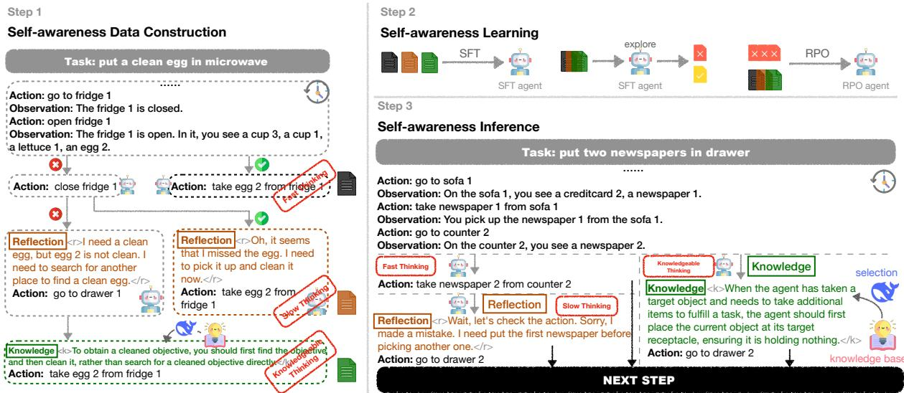
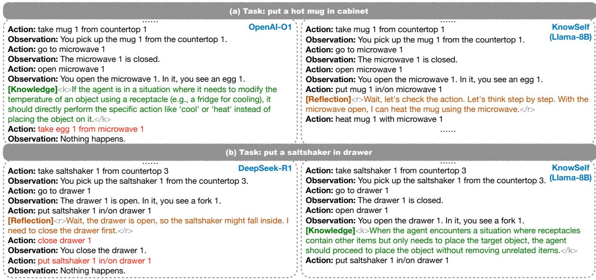

# KnowSelf: Agentic Knowledgeable Self-Awareness for LLM-Based Agents

## Source
https://arxiv.org/abs/2504.03553

## Problem: Indiscriminate Knowledge Injection in Agent Planning

LLM-based agents have made significant progress in interactive planning tasks. However, current agent learning methods resemble unconscious pattern-fitting. They fall into three categories: (1) direct trajectory imitation (e.g., ReAct), (2) trial-and-error refinement (e.g., Reflexion), and (3) knowledge-augmented planning (e.g., KnowAgent, WKM). All three use a "flood irrigation" approach — indiscriminately injecting gold trajectories, external feedback, or domain knowledge regardless of whether the agent actually needs them at a given step. This leads to fragile planning, pattern collapse on unexpected inputs, and unnecessarily high inference costs.

Humans, by contrast, possess situational self-awareness: the metacognitive ability to assess whether they can handle a situation directly, need to pause and reflect, or must seek external help. KnowSelf brings this capability to LLM agents.

## KnowSelf: Three-Situation Framework and Method

KnowSelf defines three cognitive situations based on the agent's ability at each decision step:

- **Fast Thinking**: The agent can directly produce the correct action with minimal deliberation.
- **Slow Thinking**: The agent initially produces an incorrect action but can self-correct through reflection.
- **Knowledgeable Thinking**: The agent cannot produce the correct action even after reflection and must consult external knowledge.

The method has three stages:

**Step 1 — Self-Awareness Data Construction**: The agent self-explores environments. At each step, a heuristic criterion classifies the situation: if the predicted action matches the gold action → fast thinking; if reflection fixes it → slow thinking; otherwise → knowledgeable thinking. Special tokens are inserted to mark each situation type.

**Step 2 — Two-Stage Training**: First, supervised fine-tuning (SFT) teaches the agent initial self-awareness patterns. Then, Reward-based Policy Optimization (RPO) further refines the agent's ability to generate appropriate special tokens.

**Step 3 — Self-Aware Inference**: During deployment, the agent generates special tokens that trigger either direct action, reflection, or knowledge retrieval from an external knowledge base.

## Qualitative Examples

In the task "put a hot mug in cabinet," OpenAI-O1 incorrectly tries to take an egg from the microwave after opening it, while KnowSelf (Llama-8B) uses a Reflection token to realize it should heat the mug using the open microwave. In "put a saltshaker in drawer," DeepSeek-R1 reflects that the drawer is open and tries to close it first (which fails), while KnowSelf applies a Knowledge token noting that the agent should place the object without removing unrelated items.

## Main Results on ALFWorld

The table below shows success rates (%) across six ALFWorld task types. "Know%" indicates the proportion of steps using external knowledge.

| Backbone | Method | Know% | Put | Clean | Heat | Cool | Examine | Put Two | All |
|----------|------------|-------|-------|-------|-------|-------|---------|---------|-------|
| GPT-4o | ReAct | 0% | 83.33 | 74.19 | 69.57 | 85.71 | 77.78 | 64.71 | 76.12 |
| GPT-4o | Reflexion | 0% | 100.00| 87.10 | 73.91 | 90.48 | 83.33 | 70.59 | 85.07 |
| GPT-4o | ExpeL | 100% | 95.83 | 83.87 | 69.57 | 80.95 | 88.89 | 52.94 | 79.85 |
| Llama-8B | ReAct | 0% | 33.33 | 3.23 | 0.00 | 57.14 | 66.67 | 23.53 | 27.61 |
| Llama-8B | Reflexion | 0% | 62.96 | 22.73 | 5.88 | 64.29 | 86.36 | 50.00 | 51.49 |
| Llama-8B | ExpeL | 100% | 83.33 | 32.26 | 30.43 | 23.81 | 55.56 | 17.65 | 41.04 |
| Llama-8B | ETO | 0% | 91.67 | 70.59 | 82.61 | 61.90 | 88.89 | 64.71 | 78.36 |
| Llama-8B | KnowAgent | 100% | 87.50 | 93.55 | 65.22 | 66.67 | 61.11 | 64.71 | 75.37 |
| Llama-8B | WKM | 100% | 95.83 | 87.10 | 86.96 | 61.90 | 66.67 | 52.94 | 77.61 |
| **Llama-8B** | **KnowSelf** | **15.01%** | **91.67** | **87.10** | **91.30** | **85.71** | **77.78** | **64.71** | **84.33** |
| Gemma-2B | ReAct | 0% | 0.00 | 9.68 | 0.00 | 4.76 | 44.44 | 0.00 | 8.96 |
| Gemma-2B | ETO | 0% | 91.67 | 83.87 | 78.26 | 52.38 | 77.78 | 29.41 | 71.64 |
| Gemma-2B | KnowAgent | 100% | 91.67 | 90.32 | 69.57 | 71.43 | 66.67 | 41.18 | 73.88 |
| Gemma-2B | WKM | 100% | 91.67 | 87.10 | 78.26 | 71.43 | 61.11 | 52.94 | 76.12 |
| **Gemma-2B** | **KnowSelf** | **26.41%** | **87.50** | **93.55** | **73.91** | **76.19** | **83.33** | **52.94** | **79.85** |

## Key Findings

- **KnowSelf with Llama-8B achieves 84.33% overall on ALFWorld, surpassing GPT-4o ExpeL (79.85%) while using only 15% knowledge** — demonstrating that selective knowledge use outperforms blanket application.
- **Even the smaller Gemma-2B model reaches 79.85% with KnowSelf**, matching GPT-4o ExpeL and exceeding all other Gemma-2B baselines, showing the approach scales down effectively.
- **Methods using 100% knowledge (ExpeL, KnowAgent, WKM) often underperform KnowSelf**, confirming that indiscriminate knowledge injection can hurt rather than help agent performance.
- **The three-situation taxonomy (fast/slow/knowledgeable thinking) provides a principled framework** for agents to autonomously regulate cognitive resources, analogous to human metacognition.
- **KnowSelf's special-token mechanism is lightweight and data-efficient**, requiring only heuristic labeling on self-explored trajectories rather than expensive human annotation or massive external feedback.