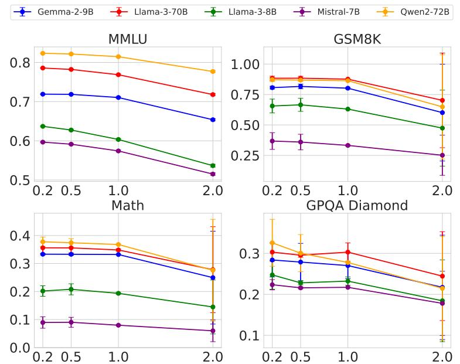
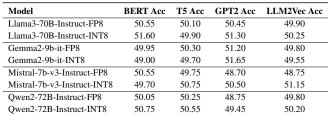

# Auditing Model Substitution in LLM APIs

## Source
https://arxiv.org/abs/2504.04715

## The Model Substitution Problem

Commercial LLM API providers charge users for access to specific models (e.g., Llama-3-70B, Qwen2-72B), but the black-box nature of APIs means users have no guarantee the advertised model is actually being served. Providers face strong economic incentives to covertly substitute cheaper alternatives — quantized versions, smaller models, or entirely different architectures — to reduce GPU costs while maintaining pricing.

The paper formalizes this as a hypothesis testing problem: given samples from the API, can an auditor distinguish the specified model's distribution P_spec(y|x) from an alternative P_actual(y|x)? Substitution types include: (1) smaller models (e.g., 8B instead of 70B), (2) quantized variants (FP8/INT8 instead of FP16), (3) fine-tuned or updated versions, and (4) entirely different model families.

## Quantization Substitution: Benchmark Impact Is Minimal

The authors evaluated five model families comparing original precision against FP8 quantization across four benchmarks. The small performance differences make detection extremely challenging.

| Model | MMLU | GSM8K | MATH | GPQA Diamond |
|---|---|---|---|---|
| Llama-3-8B-Instruct | 62.69 ± 0.18 | 61.14 ± 3.47 | 20.65 ± 3.43 | 22.62 ± 0.22 |
| Llama-3-8B-Instruct-FP8 | 62.43 ± 0.26 | 60.90 ± 4.10 | 14.91 ± 2.49 | 20.14 ± 0.24 |
| Llama-3-70B-Instruct | 78.05 ± 0.08 | 88.06 ± 1.44 | 35.69 ± 1.33 | 29.60 ± 0.51 |
| Llama-3-70B-Instruct-FP8 | 77.88 ± 0.13 | 87.35 ± 1.24 | 35.75 ± 1.16 | 33.12 ± 0.30 |
| Gemma-2-9b-it | 71.86 ± 0.08 | 81.80 ± 1.35 | 33.41 ± 0.28 | 28.64 ± 2.97 |
| Gemma-2-9b-it-FP8 | 71.92 ± 0.11 | 79.41 ± 1.14 | 32.53 ± 0.34 | 27.81 ± 3.22 |
| Qwen2-72B-Instruct | 82.18 ± 0.08 | 86.72 ± 1.00 | 37.39 ± 1.41 | 29.93 ± 2.71 |
| Qwen2-72B-Instruct-FP8 | 81.98 ± 0.08 | 86.82 ± 0.97 | 37.67 ± 1.39 | 31.08 ± 1.96 |
| Mistral-7B-Instruct-v0.3 | 59.15 ± 0.10 | 35.90 ± 4.54 | 8.94 ± 1.24 | 21.60 ± 0.17 |
| Mistral-7B-Instruct-v0.3-FP8 | 58.77 ± 0.13 | 32.20 ± 4.02 | 7.68 ± 1.23 | 22.72 ± 0.19 |

For most models, FP8 scores fall within the error bars of the original, especially on MMLU and GSM8K. Temperature scaling experiments (temperatures 0.2, 0.5, 1.0, 2.0) show that higher temperatures degrade all models' performance, further obscuring the substitution signal.

## Log Probability Fingerprinting Defeated by Nondeterminism

A promising detection approach compares token-level log probabilities between a local reference model and the API. However, the authors demonstrate that production inference environments introduce significant nondeterminism. The same Llama-3-8B model produces different log probabilities depending on the software framework (transformers 4.40 vs 4.50, vLLM 0.6.2 vs 0.8.2) and GPU hardware (A100 vs H100).

This inherent variation means an auditor cannot distinguish between a legitimate model served on different infrastructure and an actual substitution, rendering log-probability fingerprinting unreliable in practice.

## Adversarial Countermeasures

Beyond passive detection challenges, providers can actively evade audits through: (1) **Randomized substitution** — routing only a fraction p of queries to the cheaper model, making the mixed distribution approach the specified model's distribution as p decreases; (2) **Benchmark evasion** — detecting known benchmark prompts and routing them to the genuine model while serving substitutes for regular traffic. These adversarial strategies make software-only detection fundamentally query-prohibitive.

## TEEs as the Solution

The paper proposes Trusted Execution Environments (TEEs) — hardware-secured enclaves that provide cryptographic attestation of the code and data being executed. With TEEs (e.g., NVIDIA confidential computing on H100 GPUs), the provider can prove that specific model weights are loaded and that the correct inference code is running, with only modest performance overhead. Unlike ZKPs which are computationally prohibitive for large models, TEEs are practical and deployable today.

## Key Findings

- FP8 quantization reduces costs significantly while barely affecting benchmark scores, making it an attractive but nearly undetectable substitution.
- Statistical tests on text outputs (e.g., MMD) require impractically large query budgets and fail against subtle or randomized substitutions.
- Log-probability fingerprinting is defeated by production-level inference nondeterminism across software versions and GPU hardware.
- Adversarial countermeasures (randomized routing, benchmark evasion) further undermine all software-only detection approaches.
- Trusted Execution Environments provide provable, efficient, and robust model integrity guarantees, representing the most actionable solution available today.