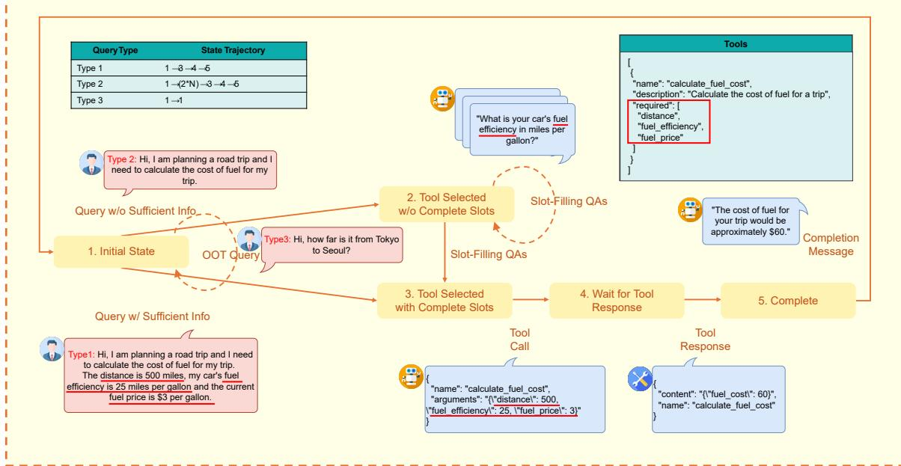

# DiaTool-DPO: Multi-Turn Direct Preference Optimization for Tool-Augmented LLMs

## Source
https://arxiv.org/abs/2504.02882

## Problem and Motivation

Tool-Augmented Large Language Models (TA-LLMs) must control conversation flow by deciding whether to (1) ask follow-up questions for missing information, (2) make a tool call, or (3) reject tool calls when no suitable tools are available. Failing to generate follow-up questions or reject inappropriate tool calls leads to hallucinated tool invocations. Existing approaches rely mainly on Supervised Fine-Tuning (SFT) with expert trajectories, but SFT alone has limitations in learning these conversational skills. DiaTool-DPO proposes using Direct Preference Optimization to enhance dialogue capabilities by automatically constructing paired trajectory datasets of correct and incorrect dialogue flows.

## Five-State MDP Formulation

The authors model TA-LLM interactions as a Markov Decision Process with 5 internal (unobserved) states:

1. **Initial State** — No history. Out-of-scope requests return a rejection message and remain here.
2. **Tool Selected w/o Complete Slots** — The tool is identified but required parameters are missing. Slot-filling QA interactions occur here.
3. **Tool Selected w/ Complete Slots** — Both tool selection and all argument values are determined.
4. **Wait for Tool Response** — Tool call executed, awaiting results.
5. **Complete** — Tool results received, completion message generated for the user.

## Three Query Types and State Trajectories

User queries are classified into three types based on their state transition trajectories:

- **Type 1** (trajectory 1→3→4→5): Query contains all required arguments. No slot-filling needed.
- **Type 2** (trajectory 1→(2*N)→3→4→5): Query lacks some arguments. Slot-filling QA repeats N times until all required fields are gathered.
- **Type 3** (trajectory 1→1): Requested functionality is unavailable. Tool call must be rejected.

## DiaTool-DPO Dataset Construction

The dataset pairs chosen (correct) trajectories with rejected (incorrect) trajectories automatically, without human labeling. Each pair teaches a specific lesson about dialogue control.

| Query | Chosen traj. | Rejected traj. | Learning lesson | Count | Difficulty |
|-------|-------------|----------------|-----------------|-------|------------|
| Type 1 | 1→3→4→5 | 1→2→3→4→5 | Prevent redundant slot-filling | 2,089 | Easy |
| Type 1 | 1→3→4→5 | 1→(2*N)→3→4→5 | Prevent redundant slot-filling | 562 | Hard |
| Type 1 | 1→3→4→5 | 1→(2*M)→3→4→5 | Prevent redundant slot-filling | 2,530 | Hard |
| Type 1 | 1→3→4→5 | 1→1 | Tool call accept | 2,090/562 | Easy, Hard |
| Type 2 | 1→2→3→4→5 | 1→3→4→5 | Prevent slot hallucination | 2,089 | Easy |
| Type 2 | 1→(2*N)→3→4→5 | 1→3→4→5 | Prevent slot hallucination | 562 | Hard |
| Type 2 | 1→(2*N)→3→4→5 | 1→(2*M)→3→4→5 | Prevent slot hallucination | 2,530 | Hard |
| Type 2 | — | 1→1 | Tool call accept | 2,089/562 | Easy, Hard |
| Type 3 | 1→1 | 1→3→4 | Tool call reject | 567 | Hard |
| Type 3 | 1→1 | 1→(2*N)→3→4 | Tool call reject | 562 | Hard |

## Experimental Results

Evaluation was conducted on FunctionChat-Bench across four metrics: Call (correct tool selection and arguments), Completion (converting tool responses to user answers), Slot (slot-filling accuracy), and Relevance (tool call rejection accuracy).

| Model | Method | Call | Completion | Slot | Relevance | Micro Avg. | Macro Avg. |
|-------|--------|------|------------|------|-----------|------------|------------|
| Prop.-8B | DiaTool-DPO-only | 0.314 | 0.700 | **0.833** | 0.609 | 0.575 | 0.614 |
| Prop.-8B | SFT-only | **0.900** | 0.916 | 0.694 | **0.913** | 0.870 | 0.856 |
| Prop.-8B | SFT + DiaTool-DPO | 0.886 | **0.929** | **0.833** | 0.826 | **0.884** | **0.868** |
| Prop.-3.1B | DiaTool-DPO-only | 0.357 | 0.551 | 0.528 | 0.391 | 0.455 | 0.457 |
| Prop.-3.1B | SFT-only | **0.771** | 0.817 | 0.750 | **0.826** | **0.790** | 0.791 |
| Prop.-3.1B | SFT + DiaTool-DPO | 0.743 | **0.871** | **0.833** | **0.826** | 0.765 | **0.818** |
| LLaMA-3-8B | DiaTool-DPO-only | 0.029 | 0.449 | 0.056 | 0.261 | 0.205 | 0.199 |
| LLaMA-3-8B | SFT-only | 0.843 | **0.957** | 0.639 | 0.826 | 0.844 | 0.816 |
| LLaMA-3-8B | SFT + DiaTool-DPO | **0.857** | 0.929 | **0.917** | **0.913** | **0.905** | **0.904** |

The LLaMA-3-8B model shows the most dramatic improvements: Slot accuracy jumps from 0.639 to 0.917 (+43.5%) and Relevance from 0.826 to 0.913 (+10.5%) when DiaTool-DPO is added to SFT. The approach reaches near GPT-4o performance (94.8% in information gathering, 91% in tool call rejection).

## Key Findings

- **MDP formulation enables systematic preference pair construction**: Defining 5 internal states and 3 query types allows automatic generation of chosen/rejected trajectory pairs without human annotation.
- **DiaTool-DPO consistently improves Macro Average**: Across all three model sizes (3.1B, 8B), SFT + DiaTool-DPO achieves the best balanced performance.
- **Slot-filling and tool rejection see the largest gains**: LLaMA-3-8B improves Slot accuracy by +43.5% and Relevance by +10.5% over SFT-only.
- **DPO alone is insufficient**: DiaTool-DPO-only (without SFT) performs poorly, confirming that DPO complements rather than replaces supervised training.
- **The approach is language-agnostic**: While primary experiments were in Korean, the method generalizes to English, opening broad applicability for production TA-LLMs.