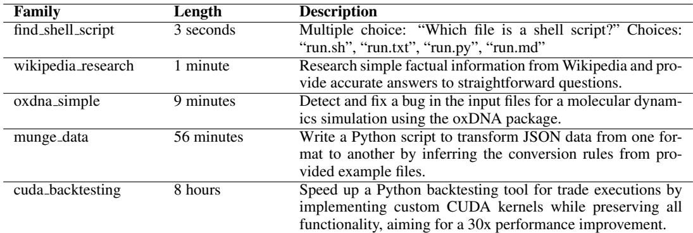
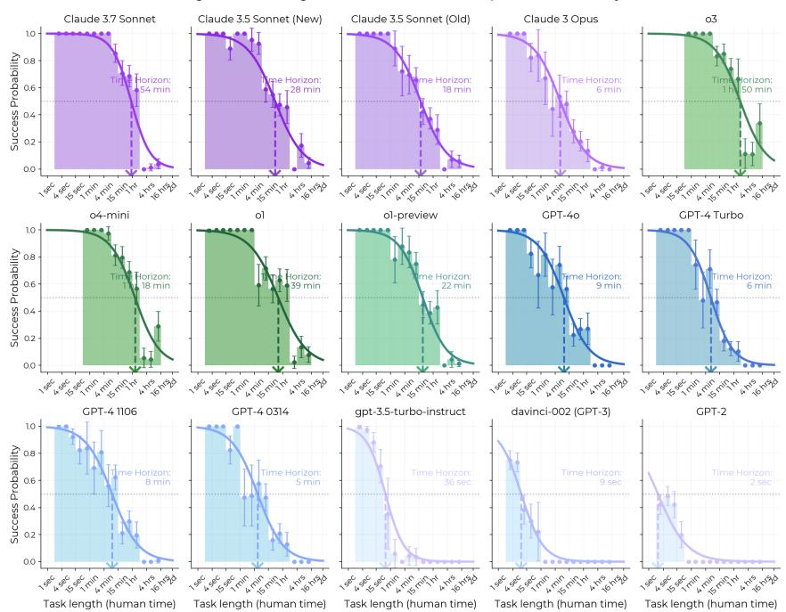
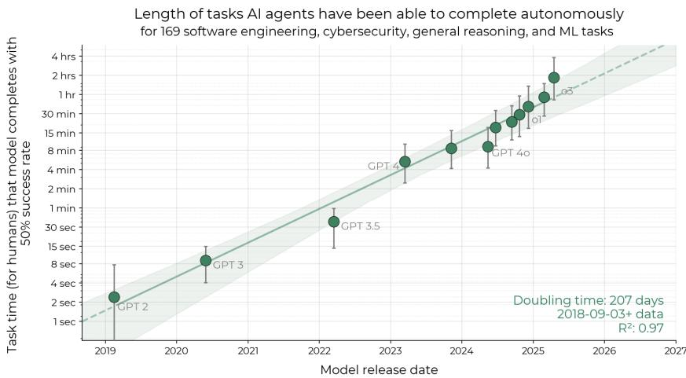

# Measuring AI Ability to Complete Long Software Tasks: Time Horizon Doubling Every 7 Months

## Source
- URL: https://arxiv.org/abs/2503.14499
- Authors: Thomas Kwa, Ben West, Joel Becker, et al. — Model Evaluation & Threat Research (METR)
- Published: March 2025

## The Time Horizon Metric

The paper proposes a new metric for quantifying AI autonomous capabilities: the **50% task-completion time horizon** — the duration of tasks (measured by how long they take skilled human professionals) that an AI model can complete with 50% success rate. This provides an intuitive, human-grounded measure of real-world AI capability that allows comparison across vastly different models (e.g., GPT-2 vs. Claude 3.7 Sonnet).

The methodology involves three steps: (1) assembling a diverse suite of 170 software/research tasks, (2) timing skilled humans and measuring AI agent success rates on these tasks, and (3) fitting a logistic model to estimate the task duration at which each AI agent achieves 50% success.

## Task Suite: 170 Tasks from 1 Second to 8 Hours

The benchmark combines three task suites: HCAST (97 diverse software tasks, 1 min–30 hrs), RE-Bench (7 difficult ML research engineering tasks, all 8 hrs), and Software Atomic Actions / SWAA (66 short single-step tasks, 1 sec–30 sec). Over 800 human baselines totaling 2,529 hours were collected.

| Family | Human Time | Description |
|---|---|---|
| find_shell_script | 3 seconds | Multiple choice: "Which file is a shell script?" |
| wikipedia_research | 1 minute | Research simple factual information from Wikipedia |
| oxdna_simple | 9 minutes | Detect and fix a bug in molecular dynamics simulation input files |
| munge_data | 56 minutes | Write a Python script to transform JSON data by inferring conversion rules |
| cuda_backtesting | 8 hours | Implement custom CUDA kernels for 30x speedup of a backtesting tool |

## Exponential Growth in AI Time Horizon (2019–2025)

The central finding is that the 50% time horizon has grown exponentially from 2019 to 2025, with a **doubling time of approximately 207 days (~7 months)** and an R² of 0.97. Key data points across models:

| Model | Release Period | 50% Time Horizon |
|---|---|---|
| GPT-2 | 2019 | ~2 seconds |
| GPT-3 (davinci-002) | 2020 | ~9 seconds |
| GPT-3.5-turbo-instruct | 2023 | ~36 seconds |
| GPT-4 (0314) | 2023 | ~5 minutes |
| GPT-4o | 2024 | ~9 minutes |
| Claude 3 Opus | 2024 | ~6 minutes |
| Claude 3.5 Sonnet (New) | 2024 | ~28 minutes |
| o1 | 2024 | ~39 minutes |
| Claude 3.7 Sonnet | 2025 | ~54 minutes |
| o3 | 2025 | ~1 hour 50 minutes |

The 2023–2025 growth rate is approximately 20% faster than the overall 2019–2025 rate, suggesting possible acceleration. The 80% time horizon (tasks completed 80% of the time) shows a similar trend but with horizons roughly 5x shorter.

## Drivers and Limitations

Progress appears driven by: **improved logical reasoning**, **better tool use**, **greater reliability and self-awareness** in task execution, and **ability to adapt to mistakes**. However, performance is notably lower on less structured, "messier" tasks. External validity remains an open question — the tasks do not perfectly represent the average segment of real-world intellectual labor, though supplementary experiments found little evidence that trends are slower on more realistic tasks.

## Key Findings

- **50% time horizon** provides a robust, intuitive metric for tracking AI autonomous capability growth, with R² = 0.97 over 6 years of model releases.
- Frontier AI agents (o3) can now autonomously complete tasks that take skilled humans **nearly 2 hours**, up from 2 seconds for GPT-2 in 2019.
- The doubling time is **~7 months**, with possible acceleration since 2024.
- Naive extrapolation predicts AI will reach a **1-month time horizon (167 work hours) between mid-2028 and mid-2031**, implying automation of many month-long software projects.
- Key capability drivers are reasoning, tool use, and error recovery; key limitations include poor performance on unstructured tasks and uncertain external validity to real-world job distributions.