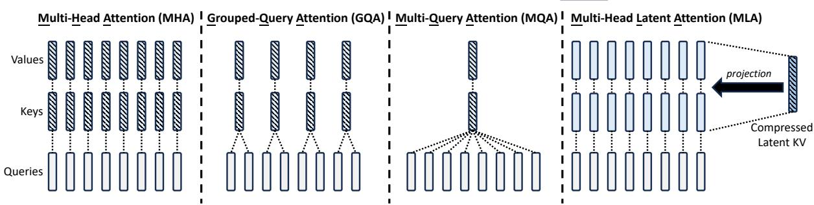
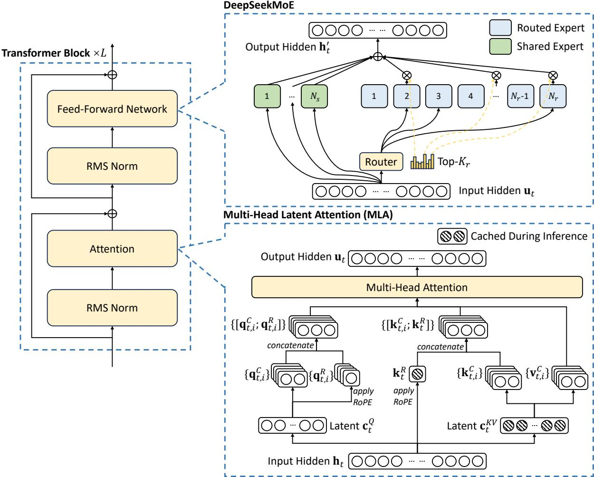
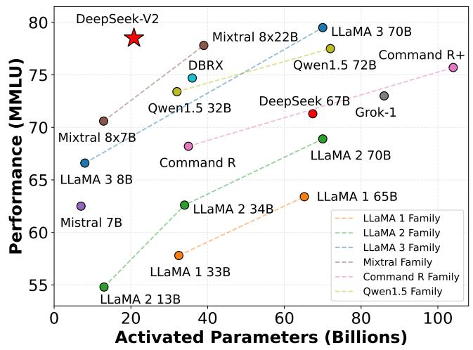

# DeepSeek-V2: Efficient MoE Language Model with Multi-Head Latent Attention

## Source
https://arxiv.org/abs/2405.04434

## Model Overview

DeepSeek-V2 is a Mixture-of-Experts (MoE) language model with 236B total parameters, of which only 21B are activated per token. It supports a 128K-token context length. The model was pretrained on 8.1T tokens from a high-quality, multi-source corpus with extended Chinese data. Post-training includes Supervised Fine-Tuning (SFT) on 1.5M conversational sessions and Reinforcement Learning via Group Relative Policy Optimization (GRPO).

Compared with DeepSeek 67B (a dense predecessor), DeepSeek-V2 delivers:
- **42.5% reduction** in training costs
- **93.3% reduction** in KV cache size
- **5.76× higher** maximum generation throughput

## Multi-Head Latent Attention (MLA)

Conventional Multi-Head Attention (MHA) stores full key-value pairs per head per token, creating a KV cache bottleneck during autoregressive generation. Alternatives like Grouped-Query Attention (GQA) and Multi-Query Attention (MQA) reduce cache but sacrifice performance.

MLA introduces **low-rank key-value joint compression**: instead of caching full K and V vectors, MLA compresses them into a compact latent vector $\mathbf{c}_t^{KV}$, which is cached during inference. Full keys, values, and a decoupled RoPE-based positional key are reconstructed on-the-fly via learned projection matrices. This yields **better performance than MHA** while requiring dramatically less cache.

## DeepSeekMoE Architecture

The FFN layers use the DeepSeekMoE design with two expert types:
- **Shared experts** ($N_s$): always activated, capture common knowledge
- **Routed experts** ($N_r$): sparsely activated via a top-$K_r$ router

Fine-grained expert segmentation increases specialization potential. Device-limited routing constrains each token to experts on at most $M$ devices, reducing cross-node communication. Auxiliary losses enforce load balance across experts and devices, and a token-dropping strategy during training prevents expert overflow without affecting inference.

## Performance Benchmarks

DeepSeek-V2 achieves top-tier MMLU performance among open-source models while activating far fewer parameters than competitors.

| Model | Activated Params (B) | MMLU Score |
|---|---|---|
| DeepSeek-V2 | 21 | 78.5 |
| LLaMA 3 70B | 70 | 77.0 |
| Mixtral 8x22B | 39 | 77.6 |
| Qwen1.5 72B | 72 | 75.6 |
| DeepSeek 67B | 67 | 73.0 |
| LLaMA 2 70B | 70 | 69.0 |
| Mixtral 8x7B | 13 | 70.6 |
| LLaMA 3 8B | 8 | 65.0 |

## Alignment and Chat Evaluation

After SFT and GRPO-based RL, DeepSeek-V2 Chat (RL) achieves strong results on open-ended conversation benchmarks:

| Benchmark | DeepSeek-V2 Chat (RL) |
|---|---|
| AlpacaEval 2.0 (length-controlled win rate) | 38.9% |
| MT-Bench (overall) | 8.97 |
| AlignBench (overall, Chinese) | 7.91 |

On AlignBench (Chinese), DeepSeek-V2 Chat (RL) outperforms all open-source models and most closed-source models, demonstrating exceptional multilingual alignment quality.

## Key Findings

- **MLA achieves superior performance to MHA** while reducing KV cache by 93.3%, making it a strictly better alternative to GQA/MQA for inference efficiency.
- **DeepSeekMoE with fine-grained experts and shared expert isolation** enables training a 236B-parameter model at 42.5% lower cost than a 67B dense model.
- **Only 21B activated parameters** are needed to match or exceed 70B-class dense models (LLaMA 3 70B, Qwen1.5 72B) on MMLU.
- **5.76× throughput improvement** over DeepSeek 67B makes DeepSeek-V2 practical for large-scale deployment.
- **DeepSeek-V2 Chat (RL) is the strongest open-source chat model in Chinese** and competitive with closed-source systems in English open-ended evaluation.