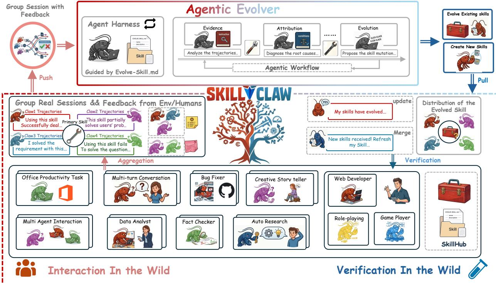

# SkillClaw: Collective Skill Evolution for Multi-User LLM Agent Ecosystems

## Source
https://arxiv.org/abs/2604.08377

## Problem: Static Skills in LLM Agent Systems

LLM agents such as OpenClaw rely on reusable skills to perform complex tasks, but these skills remain static after deployment. Users manually install skills from a centralized hub, and solutions discovered during interaction rarely persist beyond individual sessions. As similar tasks recur across different users and over time, the same patterns of failure and recovery are repeatedly observed, yet the system does not improve. Each user is forced to rediscover solutions independently, preventing knowledge from accumulating at the system level.

Existing approaches fail to bridge this gap. Memory-based methods store past trajectories but remain tied to specific instances and are hard to generalize. Skill-based methods compress experience into structured instructions but treat the resulting library as a static resource that does not evolve through usage.

## SkillClaw Framework Architecture

SkillClaw is a framework for collective skill evolution in multi-user agent ecosystems. It adopts a centralized evolution architecture with a closed-loop pipeline:

**Multi-user Interaction → Session Collection → Skill Evolution → Skill Synchronization**

Independent agents interact with their environments and produce structured session trajectories that preserve full action–feedback causal chains. These trajectories are aggregated across users and grouped by referenced skills, forming a shared evidence base. An **agentic evolver** analyzes each skill-specific group through three stages:

1. **Evidence**: Analyze the trajectories to identify behavioral patterns
2. **Attribution**: Diagnose root causes of failures and successes
3. **Evolution**: Propose skill mutations — refining existing skills or creating new ones

Updated skills are verified before being merged into the shared repository and synchronized back to all agents. The evolution process is driven by an autonomous agent performing open-ended reasoning over interaction evidence, not predefined update rules.

Different users exercising the same skill under diverse contexts produce complementary views of that skill's behavioral boundary, revealing both conditions under which it works and those under which it breaks. A single user rarely generates enough signal to separate a generalizable improvement from an idiosyncratic fix.

## Evolution Case Studies

Two detailed evolution logs illustrate how SkillClaw's verification process works over multiple days:

### Multimodal Creative Task Pipeline (6-Day Log)

| Day | Candidate Skill | Skill Function | Validator | Next-Day Action |
|-----|----------------|----------------|-----------|----------------|
| 1 | validate-tmp-workspace-inputs | Check /tmp_workspace inputs & environment setup | Accept | Upgrade to new best pool |
| 2 | multimodal-input-validation-and-setup | Multimodal input validation & output env init | Reject | Keep current best pool |
| 3 | multimodal-creative-task-pipeline | Multimodal creative pipeline (extract from PDF/video/image) | Reject | Keep current best pool |
| 4 | multimodal-creative-task-pipeline (impr.) | Added image classification, visual generation, structured validation | Reject | Keep current best pool |
| 5 | multimodal-creative-task-pipeline (impr.) + validate-required-input-files | Creative pipeline + per-file fail-fast validation | Reject | Keep current best pool |
| 6 | multimodal-creative-task-pipeline (cand.) | Extended PDF-to-poster / document-to-visual paths | Reject | Not admitted to next cycle |

Only 1 of 6 candidates was accepted, illustrating the conservative verification process that prevents regressions.

### Git Push Auth-Fallback Skill (6-Day Log)

| Day | Candidate Skill | Change Summary | Validator | Next-Day Action |
|-----|----------------|----------------|-----------|----------------|
| 1 | git-push-with-auth-fallback | Safe fallback instead of blocking on push failure | Accept | Add to Safety best pool |
| 2 | git-push-with-auth-fallback | Unified patch/bundle filenames, reduced inconsistency | Accept | Keep updated best pool |
| 3 | git-push-with-auth-fallback + git-clone-to-directory | Auth-alternative paths & secrets audit; fixed subshell pitfalls | Accept | Keep current best pool |
| 4 | (none) | Same-pool retest; validator confirmed current pool as best | Accept | Continue same best pool |
| 5 | git-push-with-auth-fallback | Added "push hang treated as auth failure"; no improvement | Reject | Keep current best pool |
| 6 | git-push-with-auth-fallback | Added identity config & filename consistency; no improvement | Reject | Not admitted to next cycle |

Here 3 of 6 days yielded accepted updates, showing successful iterative refinement before reaching a plateau.

## Three Distinguishing Properties

SkillClaw introduces three key properties:
- **Collective evolution**: Knowledge from individual interactions contributes to a shared, continuously improving skill ecosystem
- **Fully automatic**: Skill evolution is driven by runtime interaction without manual curation or explicit user intervention
- **Agentic evolution paradigm**: Skill updates are produced through open-ended reasoning rather than predefined update rules

SkillClaw is compatible with a range of Claw-style agent systems including OpenClaw, CoPaw, IronClaw, PicoClaw, ZeroClaw, NanoClaw, and NemoClaw. Evaluation on WildClawBench using Qwen3-Max as the backbone model demonstrates substantial improvements across tasks.

## Key Findings

- Static skill ecosystems force users to independently rediscover solutions, preventing system-level knowledge accumulation
- Cross-user trajectory aggregation provides complementary behavioral signals that a single user cannot generate alone
- The agentic evolver's three-stage pipeline (Evidence → Attribution → Evolution) enables context-aware skill mutations through open-ended reasoning
- Conservative verification prevents regressions: in the creative pipeline case, only 1 of 6 candidate skills was accepted over 6 days
- Iterative refinement works when evidence supports it: the git auth-fallback skill was successfully improved 3 times before plateauing