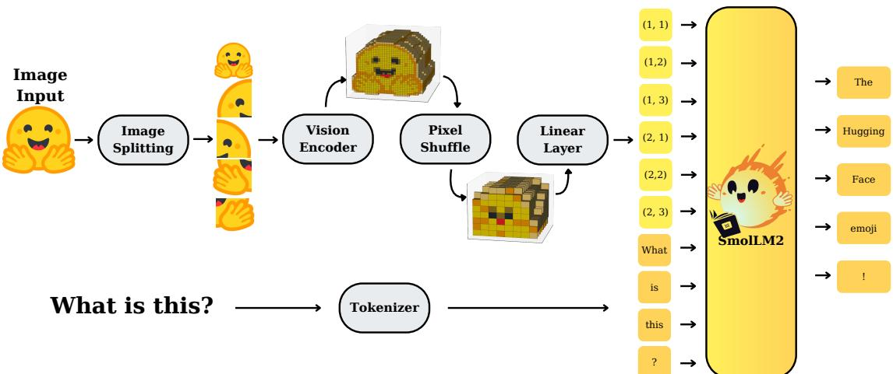
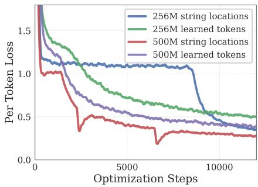
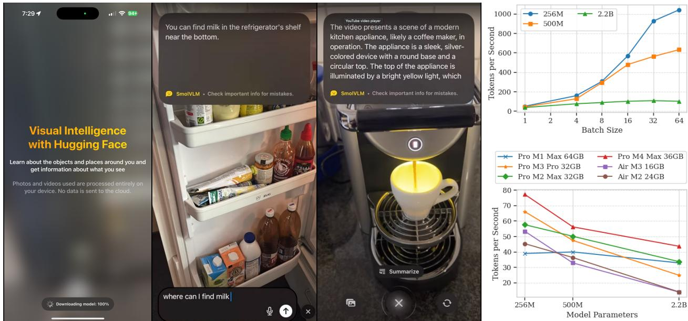

# SmolVLM: Redefining Small and Efficient Multimodal Models

## Source
https://arxiv.org/abs/2504.05299

## Overview

SmolVLM is a family of compact vision-language models (VLMs) from Hugging Face and Stanford University, designed for resource-efficient inference on mobile and edge devices. The series includes three model sizes — 256M, 500M, and 2.2B parameters — that achieve competitive performance against much larger models while using dramatically less GPU memory. The smallest model, SmolVLM-256M, runs inference with less than 1GB GPU RAM and outperforms the 300× larger Idefics-80B model. All weights, datasets, code, and a mobile app (HuggingSnap) are fully open-sourced.

## Architecture Design

SmolVLM uses a pipeline where images are split into sub-images, encoded by a SigLIP vision encoder, compressed via pixel shuffle (space-to-depth), projected through a linear layer into the SmolLM2 language model's input space, and concatenated with text token embeddings. For video, frames are sampled and processed similarly.

Three critical architectural findings drive the design:

**Finding 1 — Balanced Encoder-LM Compute:** Compact VLMs benefit from smaller vision encoders. A 93M SigLIP-B/16 paired with a 135M LM outperforms a 428M SigLIP-SO400M with the same LM. Only at 1.7B LM scale does the larger encoder justify its 10% parameter overhead.

**Finding 2 — Extended Context Length:** Performance improves significantly when extending context from 2K to 16K tokens. This was achieved by increasing the RoPE base from 10K to 273K and fine-tuning on mixed long/short-context data. The 2.2B model uses 16K context; smaller variants use 8K.

**Finding 3 — Aggressive Token Compression:** Pixel shuffle rearranges spatial features into channels, reducing visual tokens by r². While larger models use r=2, small VLMs benefit from r=4 (16× token reduction), easing attention overhead and improving long-context modeling.

## Benchmark Performance

SmolVLM was evaluated across 13 benchmarks spanning single-image understanding, multi-task reasoning, and video comprehension. The "Efficient OS" column shows the best open-source model under similar constraints.

| Capability | Benchmark | SmolVLM 256M | SmolVLM 500M | SmolVLM 2.2B | Best Efficient OS |
|---|---|---|---|---|---|
| Single-Image | OCRBench | 52.6% | 61.0% | 72.9% | 54.7% (Molmo-A1B-7B) |
| Single-Image | AI2D | 46.4% | 59.2% | 70.0% | 71.0% (Molmo-A1B-7B) |
| Single-Image | ChartQA | 55.6% | 62.8% | 68.7% | 48.0% (Molmo-A1B-7B) |
| Single-Image | TextVQA | 50.2% | 60.2% | 73.0% | 61.5% (Molmo-A1B-7B) |
| Single-Image | DocVQA | 58.3% | 70.5% | 80.0% | 77.7% (Molmo-A1B-7B) |
| Single-Image | ScienceQA | 73.8% | 80.0% | 89.6% | 87.5% (Molmo-A1B-7B) |
| Multi-task | MMMU | 29.0% | 33.7% | 42.0% | 33.9% (Molmo-A1B-7B) |
| Multi-task | MathVista | 35.9% | 40.1% | 51.5% | 37.6% (Molmo-A1B-7B) |
| Multi-task | MMStar | 34.6% | 38.3% | 46.0% | 43.1% (Molmo-A1B-7B) |
| Video | Video-MME | 33.7% | 42.2% | 52.1% | 45.0% (InternVL2-2B) |
| Video | MLVU | 40.6% | 47.3% | 55.2% | 48.2% (InternVL2-2B) |
| **Average** | **All Benchmarks** | **44.0%** | **51.0%** | **59.8%** | — |

**RAM Usage:** SmolVLM-256M uses 0.8 GB (batch=1), SmolVLM-500M uses 1.2 GB, and SmolVLM-2.2B uses 4.9 GB. For comparison, Molmo-A1B-7B requires 27.7 GB.

## On-Device Deployment

SmolVLM runs on-device via the HuggingSnap iOS app, processing photos and videos entirely locally with no cloud dependency. Throughput benchmarks across Apple Silicon devices show:

- SmolVLM-256M achieves up to ~80 tokens/second on Pro M1 Max 64GB
- At batch size 64, the 256M model reaches nearly 1000 tokens/second on high-end devices
- Even on a MacBook Air M3 16GB, the 256M model produces ~55 tokens/second
- Throughput scales roughly linearly with batch size for the smallest model

## Key Findings

- **Sub-1GB inference is achievable:** SmolVLM-256M uses only 0.8 GB GPU RAM at batch size 1, enabling deployment on smartphones and low-power edge devices.
- **SmolVLM-256M surpasses the 300× larger Idefics-80B** despite an 18-month development gap, demonstrating that architectural efficiency matters more than raw scale.
- **Balanced encoder-LM sizing, aggressive pixel shuffle (r=4), and extended context (up to 16K tokens)** are the three most impactful design choices for compact VLMs.
- **SmolVLM-2.2B rivals state-of-the-art models** that consume twice the GPU memory, achieving 59.8% average across 13 benchmarks.
- **All models, data, code, and a mobile app are fully open-sourced** to promote reproducibility and on-device AI research.