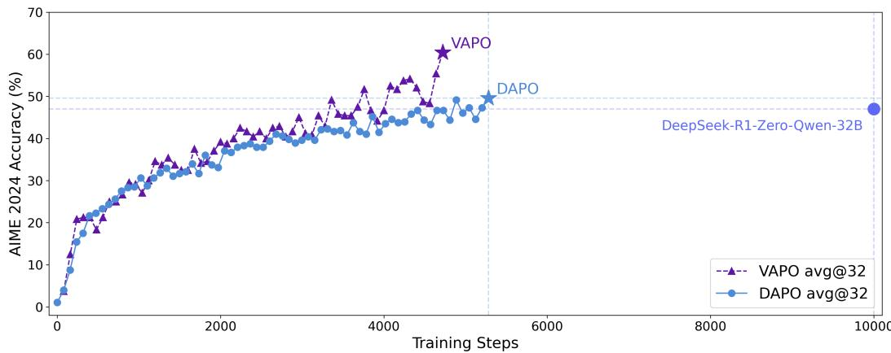
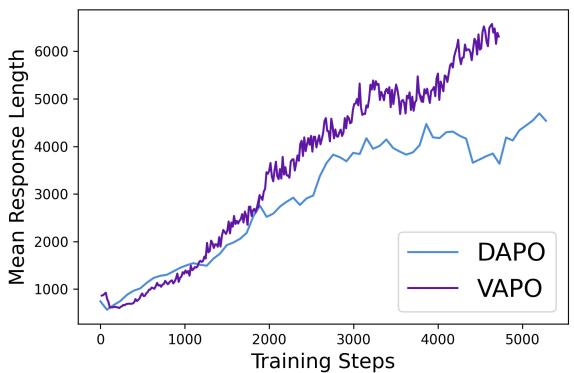

# VAPO: Value-Model-Based RL Achieves State-of-the-Art on AIME 2024

## Source
https://arxiv.org/abs/2504.05118

## Overview

VAPO (Value-model-based Augmented Proximal Policy Optimization) is a reinforcement learning framework developed by ByteDance Seed for training reasoning models with long chain-of-thought (CoT). Built on the Qwen2.5-32B pre-trained model with no SFT data, VAPO achieves a score of 60.4 on AIME 2024 (avg@32), surpassing the previous state-of-the-art DAPO (50) and DeepSeek-R1-Zero-Qwen-32B (47) by more than 10 points. VAPO reaches this performance within only 5,000 training steps and exhibits no training crashes across multiple independent runs.

## Motivation: Value-Model-Based vs Value-Model-Free

Value-model-free methods like GRPO and DAPO have been dominant in LLM RL training. They compute advantage based on final trajectory reward and assign it uniformly across all tokens. While effective, this approach has limitations for complex reasoning:

- **Credit assignment**: Value models enable precise token-level credit assignment, tracing each action's impact on returns. This is critical when subtle step-level errors cause catastrophic failures.
- **Variance reduction**: Value models provide lower-variance estimates per token compared to Monte Carlo methods.
- **Generalization**: A well-trained value model generalizes across samples, improving sample efficiency.

However, training value models for long-CoT tasks faces three core challenges: (1) **value model bias** from long trajectories and bootstrapped learning, (2) **heterogeneous sequence lengths** requiring different bias-variance tradeoffs, and (3) **reward signal sparsity** where only the final <eos> token receives reward.

## VAPO Framework Components

VAPO integrates multiple techniques to address these challenges:

- **Value-Pretraining**: Pre-trains the value model before RL to reduce initial bias.
- **Decoupled-GAE**: Separates GAE computation to handle value estimation more robustly (from VC-PPO).
- **Length-adaptive GAE** (novel): Dynamically adjusts the λ parameter in GAE based on response length. Short responses use lower λ (lower variance), while long responses use higher λ (lower bias), optimizing the bias-variance tradeoff across heterogeneous lengths.
- **Clip-Higher**: Asymmetric clipping from DAPO that encourages exploration.
- **Token-level Loss**: Normalizes loss at the token level rather than sequence level (from DAPO).
- **Positive Example LM Loss**: Self-imitation learning on correct trajectories.
- **Group-Sampling**: Samples multiple responses per prompt for better baseline estimation (from GRPO).

## Main Results and Ablation Study

| Model | AIME24 avg@32 |
|---|---|
| Vanilla PPO | 5 |
| DeepSeek-R1-Zero-Qwen-32B | 47 |
| DAPO | 50 |
| VAPO w/o Value-Pretraining | 11 |
| VAPO w/o Decoupled-GAE | 33 |
| VAPO w/o Length-adaptive GAE | 45 |
| VAPO w/o Clip-Higher | 46 |
| VAPO w/o Token-level Loss | 53 |
| VAPO w/o Positive Example LM Loss | 54 |
| VAPO w/o Group-Sampling | 55 |
| **VAPO** | **60** |

The ablation reveals that Value-Pretraining is the most critical component (removing it drops from 60 to 11), followed by Decoupled-GAE (drop to 33) and Length-adaptive GAE (drop to 45).

The training curve shows VAPO consistently outperforms DAPO throughout training and reaches 60% accuracy around step 4,500, while DAPO plateaus near 50% at step 5,500. DeepSeek-R1-Zero-Qwen-32B reaches 47% after approximately 10,000 steps.

VAPO generates longer responses than DAPO (reaching ~6,000 tokens vs ~4,500), suggesting it learns more elaborate reasoning chains.

## Key Findings

- **VAPO achieves 60.4 on AIME 2024**, surpassing DAPO (50) and DeepSeek-R1-Zero-Qwen-32B (47) by 10+ points, all on the same Qwen2.5-32B base model with no SFT data.
- **Value-Pretraining is the single most impactful component**, contributing 49 points (from 11 to 60); without it, value-model-based RL barely works.
- **Length-adaptive GAE is a novel and effective technique** that addresses the heterogeneous sequence length problem unique to long-CoT reasoning, contributing 15 points.
- **VAPO is highly training-efficient and stable**, reaching SOTA in ~5,000 steps with zero training crashes across multiple runs, compared to DAPO's ~5,500 steps for a lower score.
- **Value-model-based RL can outperform value-model-free methods** for complex reasoning when the three core challenges (bias, heterogeneous lengths, reward sparsity) are systematically addressed.