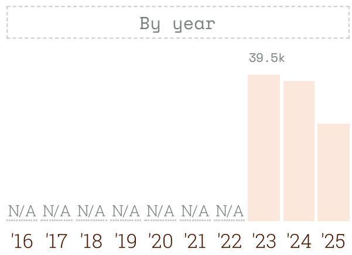
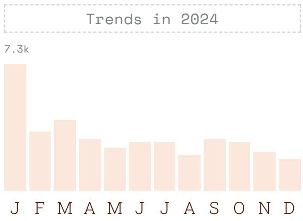

# 2024 JavaScript Rising Stars: Top Projects and Ecosystem Shifts

## Source
https://risingstars.js.org/2024/en

This is the 9th edition of JavaScript Rising Stars, analyzing GitHub stars added over the last 12 months for projects curated by Best of JS.

## Top 10 Most Popular Projects Overall

The following table shows the projects that gained the most GitHub stars in 2024:

| Rank | Project | Description | Stars Added |
|------|---------|-------------|-------------|
| 1 | shadcn/ui | Beautifully designed copy-paste components | +38.0k |
| 2 | Excalidraw | Virtual whiteboard for hand-drawn diagrams | +27.0k |
| 3 | AFFiNE | Knowledge base combining Notion + Miro capabilities | +19.6k |
| 4 | Bruno | Open-source API testing IDE (Postman alternative) | +18.7k |
| 5 | n8n | Fair-code workflow automation with native AI | +17.0k |
| 6 | htmx | Access AJAX, WebSockets directly in HTML | +16.8k |
| 7 | Tauri | Desktop/mobile apps with web frontend | +15.9k |
| 8 | Supabase | Open-source Firebase alternative | +14.5k |
| 9 | Flowise | Drag & drop UI for custom LLM flows | +14.5k |
| 10 | Payload | Open-source fullstack Next.js framework | +14.4k |

## shadcn/ui: Back-to-Back Champion

shadcn/ui won for the second consecutive year. Its total stars reached 77.5k (created January 2023). The project gained 39.5k stars in 2023 and 38.0k in 2024, sustaining extraordinary momentum.

Key 2024 additions include: Charts (powered by Recharts), Themes (CSS variable generation), Blocks (layout collections for typical web apps), a new responsive sidebar component, and a significantly upgraded CLI supporting Next.js, Remix, Vite, Laravel, and monorepos. The CLI can now install components, themes, hooks, utils, and dependencies, and supports importing from any compatible "registry," spawning an ecosystem of derivative libraries like Motion-Primitives and Magic UI. Integration with Vercel's v0 service for AI-generated components further boosted adoption.

## Front-end Frameworks

| Rank | Framework | Stars Added |
|------|-----------|-------------|
| 1 | htmx | +16.8k |
| 2 | React | +14.2k |
| 3 | Svelte | +6.1k |
| 4 | Vue.js | +5.9k |
| 5 | Angular | +3.5k |

htmx rose from #2 in 2023 to #1 in 2024. It extends HTML with `hx-*` attributes to enable data fetching and interactivity without writing JavaScript — ideal for server-driven applications and progressive enhancement of static sites.

React 19 launched in December after three years of development. New features include Server Components, Server Functions, web component (Custom Elements) support, new hooks, and form actions. Robin Wieruch noted that React is evolving from a library into "a specification for frameworks," representing a shift toward a framework-first mindset while still allowing client-only usage. The React Compiler continues development to improve performance and DX.

Svelte 5 introduced "runes" — an explicit mechanism for declaring reactive state. Svelte holds the highest positive opinion in the State of JS survey results.

## React and Vue Ecosystems

**React Ecosystem Top 5:** shadcn/ui (+38.0k), Excalidraw (+27.0k), Payload (+14.4k), Magic UI (+13.2k), Next.js (+12.1k).

**Vue Ecosystem Top 5:** Nuxt (+6.2k), PrimeVue (+5.4k), Slidev (+4.7k), shadcn-vue (+4.1k), VitePress (+3.7k).

Vue 3.5 reworked its reactivity system, with the lighter alien-signals approach already landing in the main branch. The flourishing of Vue UI libraries (PrimeVue, shadcn-vue) signals growing ecosystem confidence. Daniel Roe (Nuxt core team lead) highlighted the active release cycle and regular performance improvements.

## Emerging Themes: AI, Desktop, and Browser Innovation

AI-adjacent projects dominated: n8n (+17.0k) for workflow automation with native AI, Flowise (+14.5k) for visual LLM flow building, and Supabase (+14.5k) as an open-source backend. Tauri (+15.9k) continued its push for lighter desktop/mobile apps built with web technologies. Browser-based innovation was showcased by PGlite (Postgres via WebAssembly) and WebVM (a virtual machine running entirely in the browser).

## Key Findings

- **Component ownership beats imports:** shadcn/ui's model of letting developers own and customize component code proved its staying power for a second year, reaching 77.5k total stars.
- **HTML-first is serious:** htmx overtook React as the #1 front-end framework by stars added, validating server-driven, low-JavaScript architectures.
- **React is becoming a framework spec:** With Server Components and Server Functions in React 19, multiple frameworks (Next.js, Remix, etc.) now interpret React's primitives differently, making React more of a specification than a standalone library.
- **AI integration is table stakes:** Four of the top 10 overall projects (n8n, Flowise, Supabase, AFFiNE) have significant AI capabilities or integrations.
- **Vue's ecosystem maturity:** A wave of high-quality UI libraries and the Vue 3.5 reactivity overhaul signal a confident, maturing Vue ecosystem.