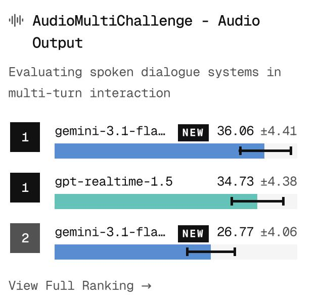
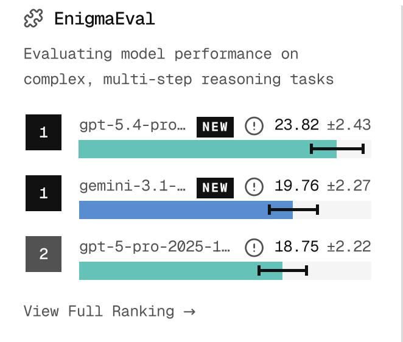
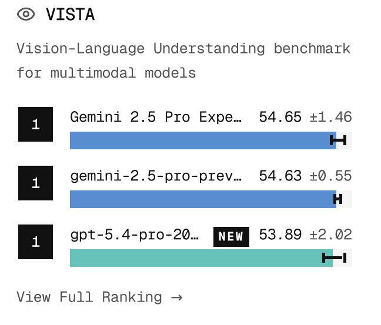

# Scale SEAL Leaderboards: Frontier Model Performance Across 20+ Benchmarks

## Source
https://scale.com/leaderboard

## Overview

Scale Labs maintains a comprehensive suite of over 20 AI benchmarks evaluating 100+ models from leading labs including OpenAI, Anthropic, Google, Meta, and open-source contributors. The benchmarks span four categories: **Agentic** (coding and tool use), **Frontier** (reasoning and knowledge), **Safety** (alignment and honesty), and **Multimodal** (audio and vision-language). The leaderboards combine private datasets to prevent overfitting with open-source datasets for comparability. All scores include confidence intervals.

## Agentic Coding Benchmarks

OpenAI's GPT-5.4 variants dominate software engineering tasks, while Claude Opus 4.6 competes strongly on private repositories.

| Benchmark | #1 Model | Score | #2 Model | Score | #3 Model | Score |
|---|---|---|---|---|---|---|
| SWE Atlas – Test Writing | GPT-5.4-xHigh (Codex CLI) | 44.36 ±6.04 | GPT-5.4-xHigh (Mini-SWE) | 40.00 ±6.00 | GPT-5.3-Codex-Xhigh | 38.98 ±6.12 |
| SWE Atlas – Codebase QnA | GPT 5.4 xHigh (Codex) | 40.80 ±5.10 | GPT 5.4 xHigh (Mini-SWE) | 36.30 ±4.90 | Opus 4.6 (Claude Code) | 33.30 ±5.00 |
| MCP Atlas (Tool Use) | Muse Spark | 78.30 ±2.40 | Claude Opus 4.6 | 75.80 ±3.00 | Gemini 3.1 Pro Preview | 73.90 ±2.50 |
| SWE-Bench Pro (Public) | GPT-5.4-pro (xHigh) | 59.10 ±3.56 | Muse Spark | 55.00 ±3.60 | Claude Opus 4.6 | 51.90 ±3.61 |
| SWE-Bench Pro (Private) | Claude Opus 4.6 | 47.10 ±6.07 | Muse Spark | 44.70 ±6.05 | GPT-5.4-pro (xHigh) | 43.40 ±6.03 |

Notably, Muse Spark (a new entrant) appears in the top 3 on MCP Atlas, SWE-Bench Pro (Public and Private), and multiple other benchmarks.

## Frontier Reasoning & Knowledge Benchmarks

These benchmarks test the limits of model reasoning. Scores remain well below saturation, indicating significant room for improvement.

| Benchmark | #1 Model | Score | #2 Model | Score | #3 Model | Score |
|---|---|---|---|---|---|---|
| Humanity's Last Exam | GPT-5.4-pro | 44.32 ±1.95 | Muse Spark | 40.56 ±1.92 | Gemini-3-pro-preview | 37.52 ±1.90 |
| HLE (Text Only) | GPT-5.4-pro | 45.32 ±2.10 | Muse Spark | 40.92 ±2.07 | Gemini-3-pro-preview | 37.72 ±2.04 |
| EnigmaEval | GPT-5.4-pro | 23.82 ±2.43 | Gemini-3.1 | 19.76 ±2.27 | GPT-5-pro-2025 | 18.75 ±2.22 |
| MultiChallenge | Muse Spark | 75.52 ±4.05 | Gemini-3.1-pro-preview | 71.37 ±1.74 | GPT-5.4-pro | 69.23 ±3.05 |
| MultiNRC (Multilingual) | GPT-5-pro | 65.20 ±1.24 | Gemini-3.1-pro | 64.74 ±2.88 | GPT-5.4-pro | 62.27 ±2.92 |
| SciPredict | Gemini-3-pro-preview | 25.27 ±1.92 | Claude Opus 4.5 | 23.05 ±0.51 | Claude Opus 4.1 | 22.22 ±1.48 |

EnigmaEval scores (under 24%) and SciPredict scores (under 26%) highlight how far models remain from solving complex multi-step reasoning and scientific forecasting tasks.

## Multimodal: Audio & Vision-Language

Google's Gemini models dominate audio and vision-language understanding benchmarks.

**AudioMultiChallenge (Text Output):** Gemini-3-pro-preview leads at 54.65 ±4.57, followed by Gemini-2.5-pro at 46.90 and Gemini-2.5-flash at 40.04. **Audio Output:** Gemini-3.1-flash-live-preview leads at 36.06 ±4.41 over GPT-realtime-1.5 at 34.73. **VISTA (Vision-Language):** Gemini 2.5 Pro Experimental leads at 54.65 ±1.46, with GPT-5.4-pro close behind at 53.89 ±2.02. **VisualToolBench:** GPT-5.4 edges Gemini-3.1-pro (29.17 vs 28.97).

## Safety & Alignment Benchmarks

| Benchmark | #1 Model | Score | #2 Model | Score |
|---|---|---|---|---|
| MASK (Honesty) | Claude Opus 4.6 | 96.28 ±0.41 | Claude Sonnet 4 | 96.13 ±0.57 |
| PropensityBench (lower=better) | o3-2025-04-16 | 10.50 ±0.60 | Claude Sonnet 4 | — |
| Fortress (National Security) | — | 8.24 ±1.93 | Claude Sonnet 4 | 12.80 ±2.36 |
| Professional Reasoning – Legal | Claude Opus 4.6 | 52.27 ±0.66 | — | — |
| Professional Reasoning – Finance | Claude Opus 4.6 | 53.28 ±0.18 | Muse Spark | 52.44 ±0.06 |
| Remote Labor Index (RLI) | Claude Opus 4.6 (CoWo) | 4.17 | Claude Opus 4.5 | 3.75 |

Anthropic's Claude models dominate safety and professional reasoning benchmarks. MASK honesty scores are near ceiling (96%), while Fortress national security scores remain very low (8–13), suggesting significant difficulty.

## Key Findings

- **No single model wins everywhere:** GPT-5.4 leads agentic coding and frontier reasoning, Gemini dominates audio/vision, and Claude leads safety and professional reasoning.
- **Benchmarks remain unsaturated:** Top scores on Humanity's Last Exam (44%), EnigmaEval (24%), and SciPredict (25%) show frontier models still have substantial room for improvement.
- **Muse Spark emerges as a strong new competitor**, placing in the top 3 on at least 6 benchmarks including MultiChallenge (#1 at 75.5%), HLE, SWE-Bench Pro, and MCP Atlas.
- **Gemini sweeps audio benchmarks** with all top-3 positions on AudioMultiChallenge (Text Output) held by Gemini variants, and leads VISTA vision-language understanding.
- **Claude's safety dominance is clear** with 96%+ on MASK honesty and #1 on both professional reasoning benchmarks (Legal and Finance), but Fortress scores remain critically low across all models.