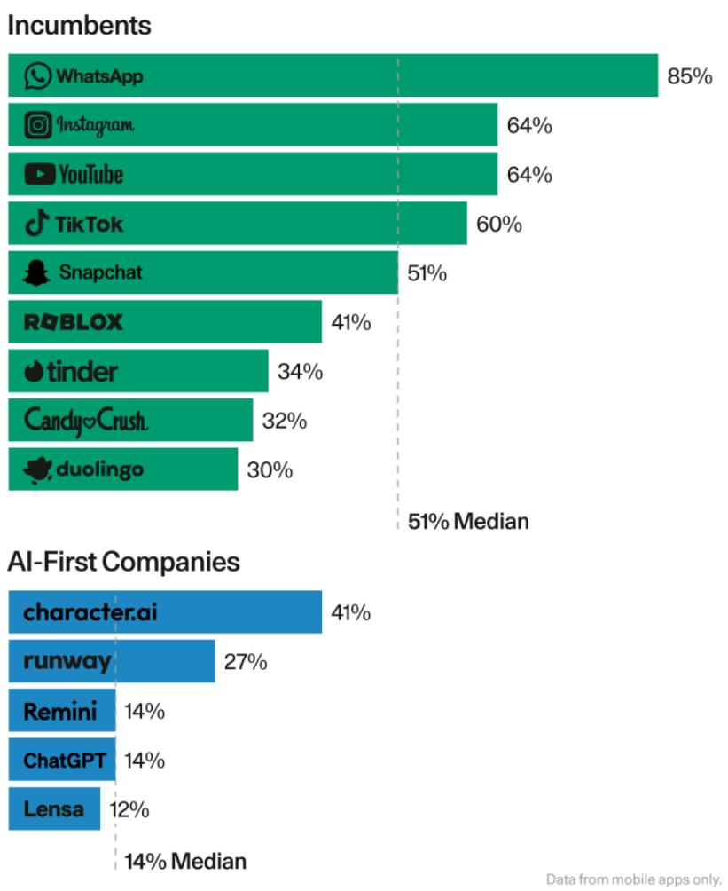
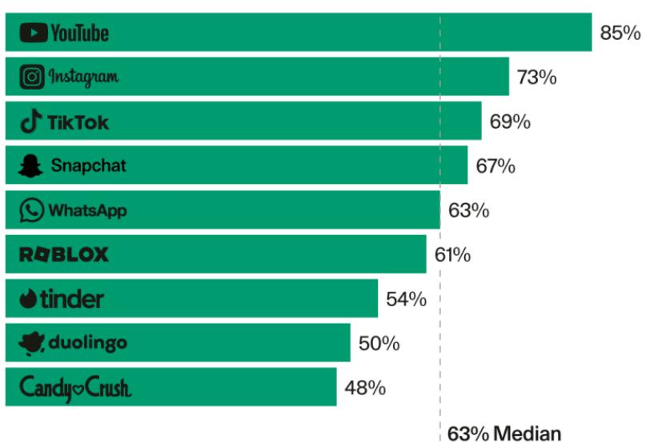

# Generative AI's Act Two: From Technology Hammer to Real Value

## Source
https://www.sequoiacap.com/article/generative-ai-act-two/

Published September 20, 2023 by Sonya Huang, Pat Grady and GPT-4 (Sequoia Capital)

## The Foundation: Decades of Convergence

Generative AI's emergence is not a sudden event but the culmination of decades of technological progress:

- **Six decades of Moore's Law** delivered the compute horsepower to process exaflops of data.
- **Four decades of the internet** (accelerated by COVID) produced trillions of tokens of training data.
- **Two decades of mobile and cloud computing** put a supercomputer in every human's palm.

ChatGPT's launch was the spark that ignited a Cambrian explosion of innovation not seen since the early internet. AI researchers became rockstars, hacker houses overflowed with autonomous agents and companionship chatbots, and the arXiv printing press became so prolific that researchers jokingly called for a pause on publications.

But excitement quickly turned to hysteria. Every company became an "AI copilot." Inboxes filled with undifferentiated pitches for "AI Salesforce" and "AI Adobe." The $100M pre-product seed round returned. Cracks appeared: artists challenged machine-generated IP, Washington debated regulation, and a whisper spread that generative AI was not actually useful — products fell short of expectations with terrible user retention.

## Early Commercial Traction Despite Skepticism

Despite the discontent, generative AI has had a more successful commercial start than SaaS, with **>$1 billion in revenue from startups alone** — a milestone that took SaaS years, not months, to reach. Standout successes include:

- **ChatGPT**: Fastest-growing application in history, with strong product-market fit among students and developers.
- **Midjourney**: Reported hundreds of millions of dollars in revenue with a team of just 11 people.
- **Character.ai**: Popularized AI entertainment and companionship; users spend an average of **2 hours per session** in-app.

However, these successes don't change the reality that many AI companies lack product-market fit or sustainable competitive advantage.

## The Retention Problem: AI-First Apps vs. Incumbents

Mobile app retention data reveals a stark gap between established consumer apps and AI-first companies:

### User Retention Comparison (Mobile Apps)

| App | Category | Retention Rate |
|---|---|---|
| WhatsApp | Incumbent | 85% |
| Instagram | Incumbent | 64% |
| YouTube | Incumbent | 64% |
| TikTok | Incumbent | 60% |
| Snapchat | Incumbent | 51% |
| Roblox | Incumbent | 41% |
| Tinder | Incumbent | 34% |
| Candy Crush | Incumbent | 32% |
| Duolingo | Incumbent | 30% |
| **Incumbent Median** | — | **51%** |
| Character.ai | AI-First | 41% |
| Runway | AI-First | 27% |
| Remini | AI-First | 14% |
| ChatGPT | AI-First | 14% |
| Lensa | AI-First | 12% |
| **AI-First Median** | — | **14%** |

A separate monthly active usage benchmark for incumbents shows even higher engagement bars:

| App | Monthly Active Usage |
|---|---|
| YouTube | 85% |
| Instagram | 73% |
| TikTok | 69% |
| Snapchat | 67% |
| WhatsApp | 63% |
| Roblox | 61% |
| Tinder | 54% |
| Duolingo | 50% |
| Candy Crush | 48% |
| **Median** | **63%** |

## From Act 1 to Act 2

Sequoia frames the generative AI market as transitioning between two phases:

**Act 1 (Technology-Out):** The discovery of foundation models as a new "hammer" led to a wave of novelty apps — lightweight demonstrations of cool technology. These apps used foundation models as the entire solution and often lacked stickiness.

**Act 2 (Customer-Back):** The emerging phase focuses on solving human problems end-to-end. Key characteristics of Act 2 companies:

- Use foundation models as **a piece** of a more comprehensive solution, not the entire product
- Introduce **new editing interfaces** that make workflows stickier and outputs better
- Are often **multi-modal** in nature
- Solve problems **end-to-end** rather than offering thin wrappers

Examples of Act 2 companies: **Harvey** (custom LLMs for elite law firms), **Glean** (crawling and indexing workspaces for relevant enterprise AI), **Character** and **Ava** (digital companions).

The updated Sequoia generative AI market map is now organized **by use case rather than model modality**, reflecting the evolution from technology hammer to actual value delivery and the increasingly multi-modal nature of applications.

## Key Findings

- **Generative AI startups exceeded $1B in revenue faster than SaaS**, proving real commercial demand despite hype-cycle skepticism.
- **AI-first apps face a severe retention gap**: 14% median retention vs. 51% for incumbent consumer apps — a 3.6x disadvantage.
- **The market is shifting from Act 1 (technology-out) to Act 2 (customer-back)**, where foundation models become components of comprehensive, workflow-integrated solutions rather than standalone products.
- **Multi-modal, end-to-end problem solving** and new editing interfaces are the hallmarks of companies likely to win in Act 2.
- **Character.ai is the retention outlier** among AI-first apps at 41%, approaching incumbent levels, suggesting that companionship/entertainment may be generative AI's strongest consumer use case.