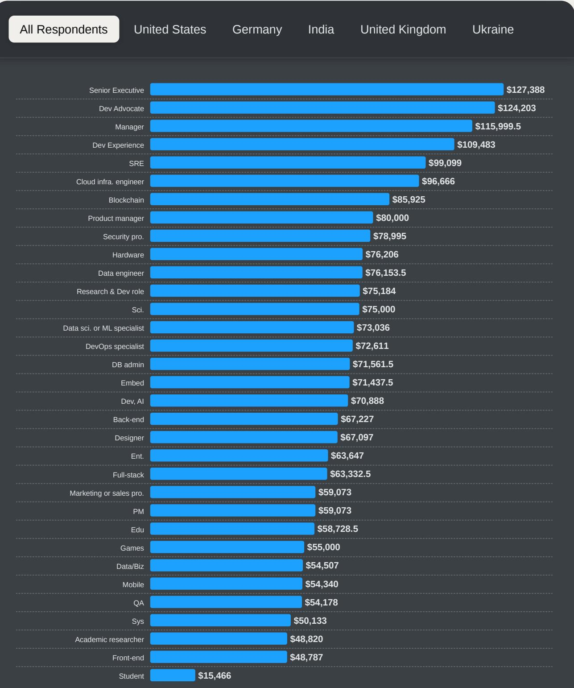
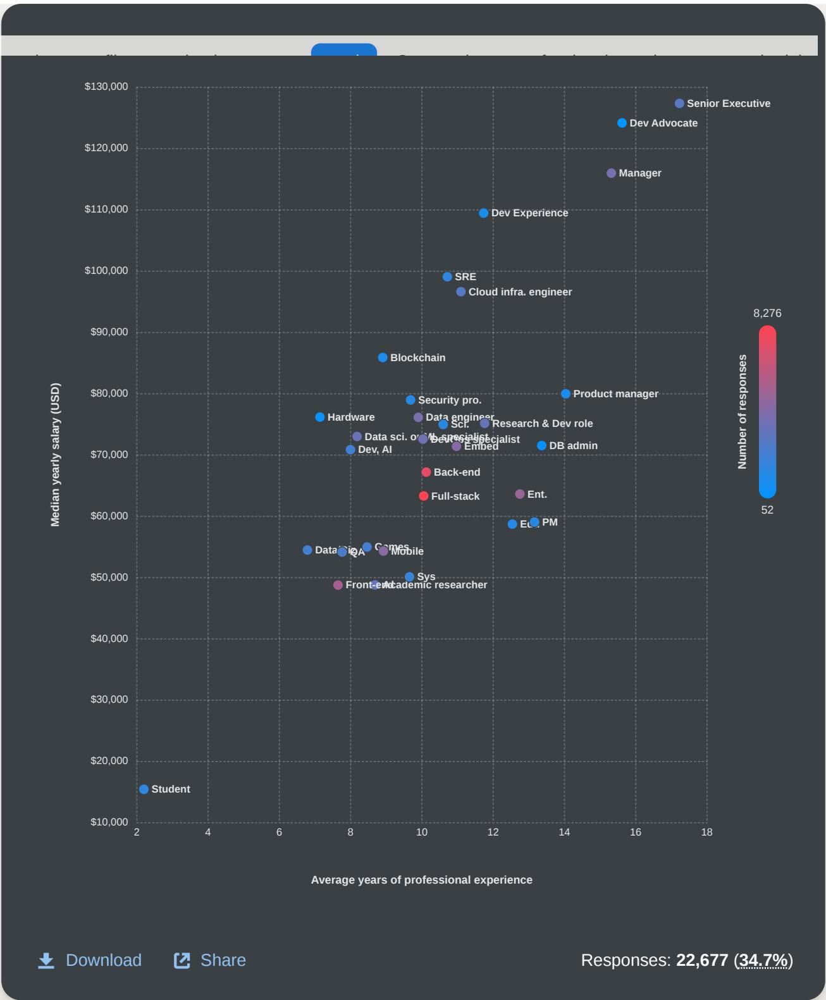
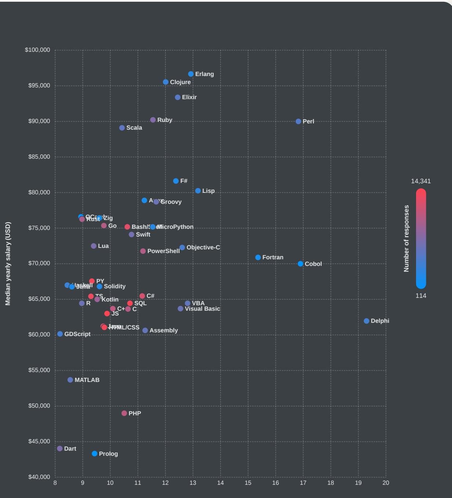

# Developer Workforce & Compensation Trends — 2024 Stack Overflow Survey

## Source
https://survey.stackoverflow.co/2024/work

## Employment Status

84% of the 65,437 respondents are currently working (full-time, part-time, or freelancing). Full-time employment is the dominant mode at 69%, followed by independent contracting/freelancing at 16.4% and full-time students at 13.2%.

In the United States specifically, full-time employment dropped from 69% in 2023 to 64.8% in 2024. In the U.K. and Ukraine, non-full-time respondents lean toward independent contracting, while in Germany and India they are more likely to be full-time students.

## Work Environment Trends

Hybrid work remains the most common arrangement at 42%, consistent with 2023. Remote work accounts for 38%. In-person work has risen for the third consecutive year — from 15% in 2022 to 16% in 2023 to 20% in 2024 — signaling a gradual return-to-office trend.

## Company Size

47% of respondents work for organizations with fewer than 100 employees. The distribution across 42,827 respondents:

| Company Size | Share |
|---|---|
| Freelancer / solo | 6.1% |
| 2–9 employees | 10.4% |
| 10–19 employees | 8.9% |
| 20–99 employees | 21.2% |
| 100–499 employees | 18.5% |
| 500–999 employees | 6.7% |
| 1,000–4,999 employees | 11.0% |
| 5,000–9,999 employees | 3.8% |
| 10,000+ employees | 11.4% |

## Salary by Developer Type

Median annual compensation (USD, all respondents) varies dramatically by role. The top and bottom roles are shown below (22,677 salary responses, 34.7% response rate):

| Developer Type | Median Salary (USD) | Avg. Years Experience |
|---|---|---|
| Senior Executive | $127,388 | ~17 |
| Dev Advocate | $124,203 | ~16 |
| Manager | $115,999 | ~15 |
| Dev Experience | $109,483 | ~12 |
| SRE | $99,099 | ~10 |
| Cloud Infra. Engineer | $96,666 | ~13 |
| Blockchain | $85,925 | ~9 |
| Product Manager | $80,000 | ~14 |
| Full-stack | $63,333 | ~10 |
| Front-end | $48,787 | ~8 |
| Student | $15,466 | ~2 |

Site reliability engineers and cloud infrastructure engineers are the highest-paid purely technical roles, reflecting their critical importance in keeping digital services running. Regionally, mobile developers earn more in the U.S., data engineers top the charts in Germany and Ukraine, and back-end developers lead in India and the U.K.

## Salary by Programming Language

Developers using niche functional languages earn the most. The overall reported salary range has dropped roughly $10K compared to 2023, now averaging $60–75K USD vs. $70–85K USD last year.

| Language | Median Salary (USD) | Avg. Years Experience |
|---|---|---|
| Erlang | ~$97,000 | ~12 |
| Clojure | ~$95,000 | ~11 |
| Elixir | ~$93,000 | ~11 |
| Perl | ~$90,000 | ~19 |
| Ruby | ~$89,000 | ~11 |
| Scala | ~$88,000 | ~9 |
| Go | ~$76,000 | ~9 |
| Python | ~$67,000 | ~9 |
| JavaScript | ~$64,000 | ~10 |
| PHP | ~$49,000 | ~10 |
| Dart | ~$44,000 | ~8 |
| Prolog | ~$43,000 | ~9 |

## Technology Purchasing Influence

62% of respondents have influence over technology purchases at their organizations. Senior executives (99%), engineering managers (87%), and product managers (77%) wield the most influence. 60% of respondents prefer a build-and-buy approach over purely building or buying. Starting a free trial (75%) and asking other developers (73%) are the top methods for evaluating new tools.

## Key Findings

- **Full-time employment is softening**: U.S. full-time employment fell 4 percentage points year-over-year; freelancing and contracting remain significant at 16%+.
- **In-person work is creeping back**: now at 20%, up from 15% in 2022, though hybrid (42%) still dominates.
- **DevRel and leadership roles command premium pay**: Senior Executives ($127K), Dev Advocates ($124K), and Managers ($116K) top the salary chart, all with 15+ years average experience.
- **Niche functional languages correlate with higher pay**: Erlang, Clojure, and Elixir developers earn >$93K median, while mainstream languages like JavaScript and PHP sit well below $65K.
- **Developers are key purchase influencers**: with 62% having a say in tech buying decisions, vendor strategies should target individual contributors, not just management.