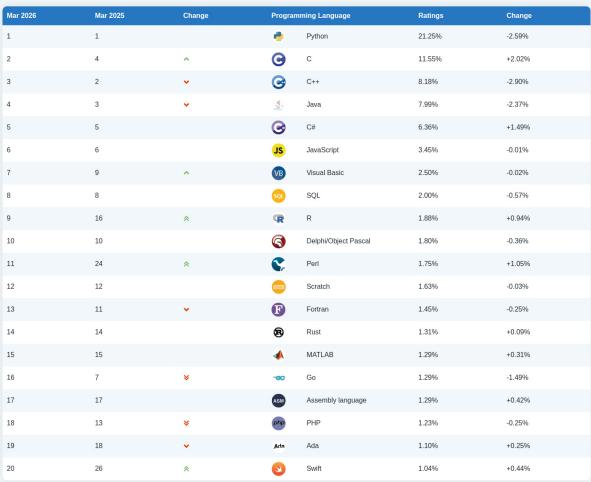
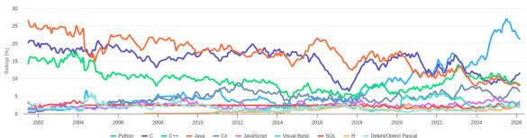
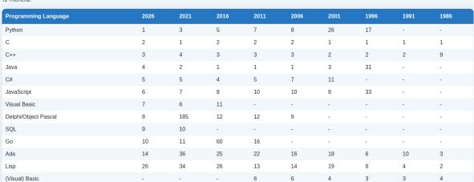
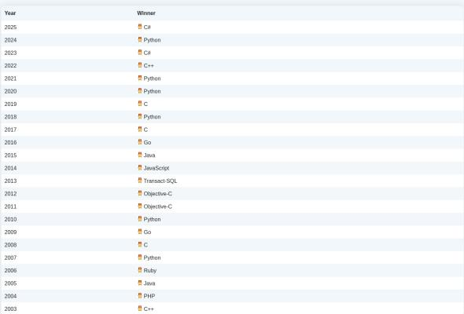

# TIOBE Programming Community Index -- March 2026 Monthly Report

## Source

- URL: https://www.tiobe.com/tiobe-index/
- Captured: April 10, 2026
- Author: Paul Jansen, CEO, TIOBE Software

The TIOBE Programming Community Index is a widely cited indicator of programming language popularity, updated monthly since 2001. Ratings are calculated from the number of skilled engineers worldwide, training courses, and third-party vendors, using search-engine hit counts across Google, Amazon, Wikipedia, Bing, and more than 20 other sites. The index does not measure which language is "best" or which has the most lines of code written; rather, it reflects how much a language is discussed and sought after on the public internet.

## March 2026 Headline: Why the TIOBE Index Still Relies on Search Engines

The March 2026 editorial addresses a recurring question: should the TIOBE index switch from search-engine hit counts to LLM-based assessments of language popularity? Paul Jansen explains that the answer is no. LLMs are ultimately trained on the same web pages that search engines index, so querying an LLM would not yield fundamentally different data. The methodology therefore remains anchored to direct measurement of web-page volume per language.

Beyond the methodology discussion, the March update records several notable rank changes. SQL and R swapped positions within the top 10, with R climbing from 16th to 9th year-over-year. Swift re-entered the top 20 at the expense of Kotlin, and Ruby is on the verge of dropping out of the top 30.

## Top 20 Programming Languages -- March 2026

| Rank (Mar 2026) | Rank (Mar 2025) | Programming Language | Rating | YoY Change |
|:---:|:---:|------|:---:|:---:|
| 1 | 1 | Python | 21.25% | -2.59% |
| 2 | 4 | C | 11.55% | +2.02% |
| 3 | 2 | C++ | 8.18% | -2.90% |
| 4 | 3 | Java | 7.99% | -2.37% |
| 5 | 5 | C# | 6.36% | +1.49% |
| 6 | 6 | JavaScript | 3.45% | -0.01% |
| 7 | 9 | Visual Basic | 2.50% | -0.02% |
| 8 | 8 | SQL | 2.00% | -0.57% |
| 9 | 16 | R | 1.88% | +0.94% |
| 10 | 10 | Delphi/Object Pascal | 1.80% | -0.36% |
| 11 | 24 | Perl | 1.75% | +1.05% |
| 12 | 12 | Scratch | 1.63% | -0.03% |
| 13 | 11 | Fortran | 1.45% | -0.25% |
| 14 | 14 | Rust | 1.31% | +0.09% |
| 15 | 15 | MATLAB | 1.29% | +0.31% |
| 16 | 7 | Go | 1.29% | -1.49% |
| 17 | 17 | Assembly language | 1.29% | +0.42% |
| 18 | 13 | PHP | 1.23% | -0.25% |
| 19 | 18 | Ada | 1.10% | +0.25% |
| 20 | 26 | Swift | 1.04% | +0.44% |

Python holds the top position at 21.25%, more than double the rating of second-place C (11.55%). However, Python's year-over-year change is -2.59 percentage points, while C gained +2.02 points. The top 4 languages -- Python, C, C++, and Java -- collectively account for nearly 49% of the total index.

## Historical Trend: Two Decades of Language Popularity (2002--2026)

The TIOBE index publishes a long-running trend chart covering the top 10 languages from 2002 to the present. Key patterns visible in the data:

- **Python's meteoric rise**: From a minor language ranked around 8th in 2006, Python surged to the top position after 2018, peaking above 25% before settling at 21.25% in March 2026.
- **C's resilience**: C has held a top-2 position for most of the 24-year span, with periodic surges (notably around 2015 and again in 2025--2026).
- **Java's long decline**: Java dominated the index from roughly 2005 to 2018, but has steadily fallen from the 25%+ range to under 8%.
- **JavaScript's plateau**: Despite its dominance in web development, JavaScript has never exceeded roughly 5% on the TIOBE index and currently sits at 3.45%.

## Very Long Term History: Rank Positions Across Four Decades

| Language | 2026 | 2021 | 2016 | 2011 | 2006 | 2001 | 1996 | 1991 | 1986 |
|------|:---:|:---:|:---:|:---:|:---:|:---:|:---:|:---:|:---:|
| Python | 1 | 3 | 5 | 7 | 8 | 26 | 17 | - | - |
| C | 2 | 1 | 2 | 2 | 2 | 1 | 1 | 1 | 1 |
| C++ | 3 | 4 | 3 | 3 | 3 | 2 | 2 | 2 | 9 |
| Java | 4 | 2 | 1 | 1 | 1 | 3 | 31 | - | - |
| C# | 5 | 5 | 4 | 5 | 7 | 11 | - | - | - |
| JavaScript | 6 | 7 | 8 | 10 | 10 | 8 | 33 | - | - |
| Go | 10 | 11 | 60 | 16 | - | - | - | - | - |
| Ada | 14 | 36 | 25 | 22 | 16 | 18 | 6 | 10 | 3 |
| Lisp | 26 | 34 | 26 | 13 | 14 | 19 | 8 | 4 | 2 |

This table reveals dramatic shifts across decades. Python was unranked before 1991, entered the top 30 only by 2001, and took 25 years to reach the top position. Conversely, Lisp was the number-2 language in 1986 but has fallen to 26th. Ada peaked at 3rd in 1986 and now sits at 14th. C is the only language that has remained in the top 2 across all nine measurement points.

## Programming Language Hall of Fame

The TIOBE "Programming Language of the Year" award goes to the language with the largest gain in ratings during a calendar year. Recent winners include:

| Year | Winner |
|:---:|------|
| 2025 | C# |
| 2024 | Python |
| 2023 | C# |
| 2022 | C++ |
| 2021 | Python |
| 2020 | Python |
| 2019 | C |
| 2018 | Python |
| 2016 | Go |

Python has won the award five times (2007, 2010, 2018, 2020, 2021, 2024), more than any other language. C# took the title in both 2023 and 2025, reflecting its continued growth driven by the .NET ecosystem.

## Key Findings

- **Python remains dominant but is losing ground**: At 21.25%, Python leads by a wide margin, yet its year-over-year decline of -2.59 percentage points is the largest drop among the top 5. C, by contrast, gained +2.02 points and climbed from 4th to 2nd.
- **Legacy languages show surprising resilience**: Perl jumped from 24th to 11th (+1.05%), R rose from 16th to 9th (+0.94%), and Fortran remains in the top 15. These languages continue to serve entrenched communities in scientific computing, data analysis, and infrastructure.
- **Go suffers its sharpest decline**: Go fell from 7th to 16th, losing 1.49 percentage points -- the largest absolute drop of any top-20 language. This contrasts with its 2016 "Language of the Year" win and suggests possible displacement by Rust (14th, +0.09%) in the systems programming space.
- **Swift re-enters the top 20, Kotlin exits**: Swift climbed from 26th to 20th (+0.44%), while Kotlin dropped to 22nd. In the mobile development ecosystem, Swift's gains may reflect Apple platform growth, while Kotlin faces competition from cross-platform frameworks.
- **The top 4 languages hold nearly half the index**: Python, C, C++, and Java together account for 48.97% of total TIOBE ratings, illustrating how concentrated the programming landscape remains despite 50+ tracked languages.
