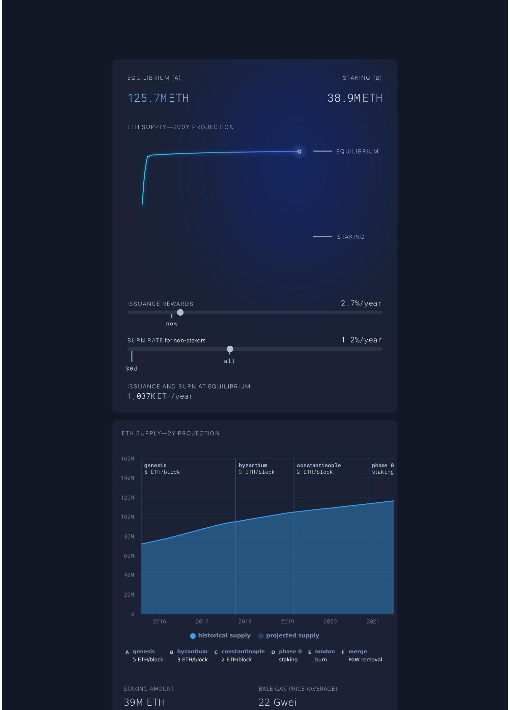
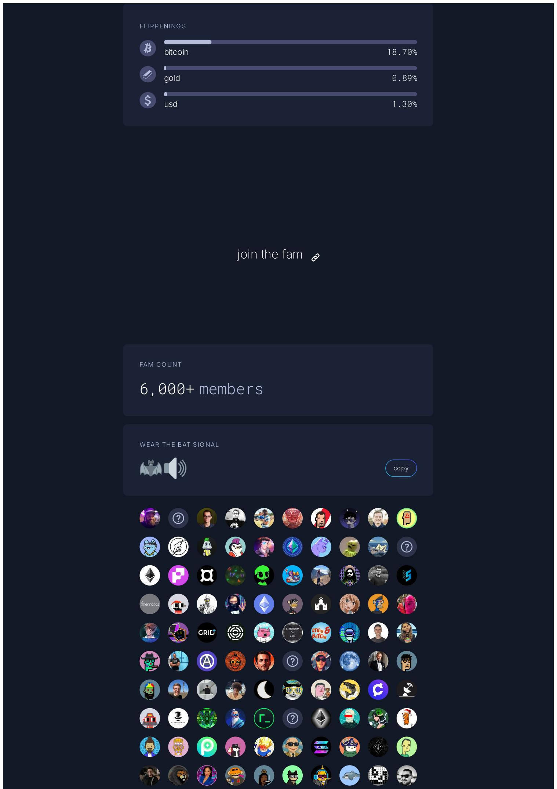

# Ultra Sound Money: Ethereum's Post-Merge Supply Dynamics

## Source
https://ultrasound.money/

## Current Supply Overview

As of the latest data, Ethereum's total supply stands at **121,603,980 ETH**, with a price of **$2,243 USD** and base gas fees at a historic low of **0.1 Gwei**. Over the trailing 7-day period, the network added a net **+19,445.89 ETH** to supply, translating to an annualized growth rate of **+0.83%/year**. This net figure results from **19,638.29 ETH issued** to validators minus only **192.39 ETH burned** through EIP-1559 base fee destruction — an issuance offset ratio of just **0.01x**, meaning burns currently offset only ~1% of new issuance.

The burn rate is suppressed by historically low gas prices. The 7-day gas market shows a minimum of 0.0 Gwei, maximum of 1.3 Gwei, and average of just 0.1 Gwei — well below the levels needed for deflationary supply dynamics. Blob gas (introduced via EIP-4844 for L2 data availability) averaged 7,144,934 wei with a total blob fee burn of only 0.15 ETH ($319) over 7 days.

## Burn Categories and Leaderboard (7-Day)

| Category | Burn (ETH) |
|---|---|
| DeFi | 31 |
| ETH transfers | 22 |
| Misc | 4 |
| NFTs | 3 |
| Contract creations | 2 |
| L2 | 0 |
| MEV | 0 |
| Blob fees | 0 |
| **Total** | **~192 ETH** |

The burn leaderboard is led by ETH transfers (21.74 ETH), Tether USDT (13.55 ETH), and various DeFi contracts. Recent blocks (e.g., 24,850,874–24,850,879) show burns of 0.00–0.01 ETH per block, reflecting the extremely low fee environment. The 7-day burn record was just 0.07 ETH in a single block.

## Staking and Validator Economics

Ethereum's proof-of-stake system currently has **38.9M ETH staked** (~32% of supply). The scarcity engine locks 9.1M ETH in staking contracts with an average time span of 10.7 years. Validator rewards break down as:

| Reward Type | Amount | APR |
|---|---|---|
| Issuance | 0.9 ETH/validator | 2.7% |
| Tips | 0.0 ETH | 0.1% |
| MEV estimate | 0.0 ETH | 0.1% |
| **Total** | | **~2.9%** |

PoS issuance runs at approximately **2,800 ETH/day**, while fee burn at current gas levels is roughly **2,200 ETH/day** under normalized assumptions (though the 7-day actual burn is far lower).

## Supply Projections and Equilibrium

The 200-year supply projection models ETH converging to an equilibrium of **125.7M ETH**, assuming 39M ETH staked and a 22 Gwei average base gas price. At equilibrium, issuance and burn balance at approximately **1,037K ETH/year**. The issuance rewards rate for stakers is 2.7%/year, while the effective burn rate for non-stakers is 1.2%/year.

The 2-year projection chart shows Ethereum's supply history across eras: genesis (5 ETH/block), Byzantium (3 ETH/block), Constantinople (2 ETH/block), phase 0 staking, London burn introduction, and the merge (PoW removal). Supply growth has flattened dramatically post-merge.

## Flippening Progress and Total Value Secured

ETH's market cap relative to competing monetary assets:

| Asset | ETH Market Cap Ratio |
|---|---|
| Bitcoin | 18.70% |
| USD | 1.30% |
| Gold | 0.89% |

Total Value Secured (TVS) on Ethereum:

| Category | Value (USD) |
|---|---|
| ETH (native) | $272.76B |
| ERC20 tokens | $22.21B |
| NFTs | $12.66B |
| **Total** | **~$307.6B** |

Top ERC20s by value include Dai ($4.41B), Shiba Inu ($3.51B), Cronos ($2.97B), and Tether Gold ($2.65B). Top NFT collections include CryptoPunks ($2.13B), Bored Ape Yacht Club ($0.68B), ENS ($0.63B), and Pudgy Penguins ($0.51B).

The community ("fam") counts 6,000+ members tracking these metrics.

## Key Findings

- **ETH is currently mildly inflationary** at +0.83%/year due to historically low gas fees (avg 0.1 Gwei), with burns offsetting only ~1% of issuance over the past 7 days.
- **DeFi and ETH transfers dominate burn activity**, accounting for roughly 85% of the 192 ETH burned in the trailing week, but absolute burn volumes are negligible at current gas levels.
- **38.9M ETH (32% of supply) is staked**, creating a significant supply lock with validators earning ~2.7% APR primarily from protocol issuance rather than tips or MEV.
- **Long-term equilibrium is projected at 125.7M ETH**, requiring sustained ~22 Gwei average gas to balance issuance and burn at ~1,037K ETH/year — the ultra sound money thesis depends on on-chain activity recovery.
- **Ethereum secures over $307B in total value** and has reached 18.7% of Bitcoin's market cap, demonstrating growing but still early monetary premium.